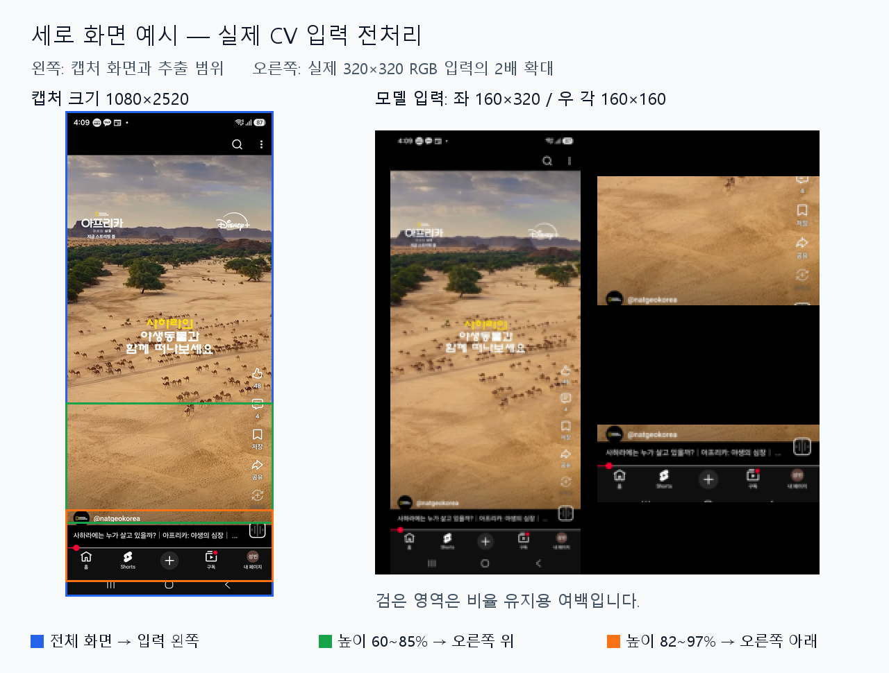
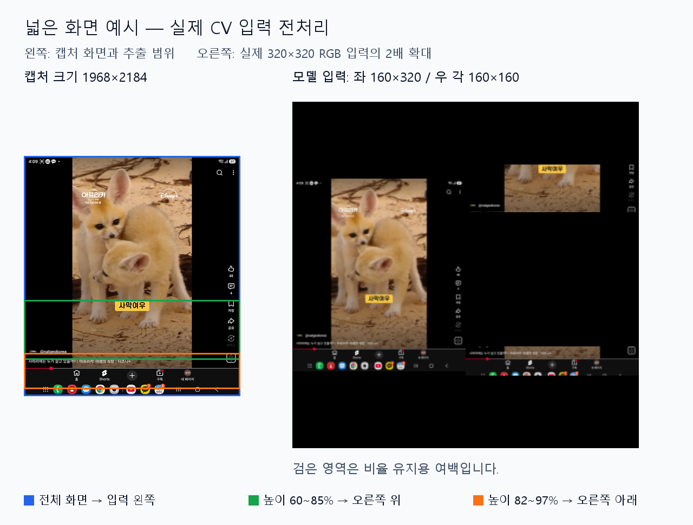
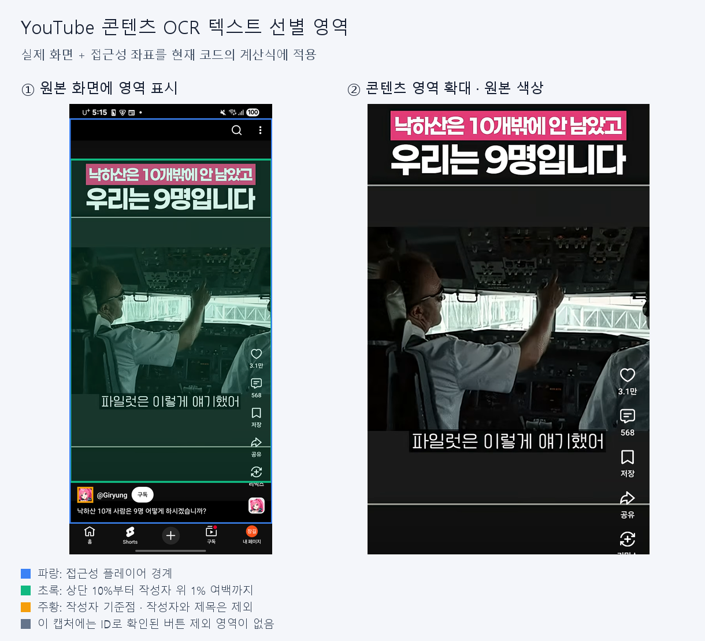

# DopamineCut — 전체 변경 내역

## 목차

1. [CV 인식](#1-cv-인식)
2. [시청 인식·시간·횟수 측정](#2-시청-인식시간횟수-측정)
3. [OCR·콘텐츠 카테고리 분류](#3-ocr콘텐츠-카테고리-분류)
4. [데이터 저장·Firebase 구조](#4-데이터-저장firebase-구조)
5. [목표 설정·개인화 추천·개입](#5-목표-설정개인화-추천개입)
6. [알림·사용 습관 변화 분석](#6-알림사용-습관-변화-분석)
7. [UI·최초 접속·설정](#7-ui최초-접속설정)
8. [코드 구조·안정성·보안](#8-코드-구조안정성보안)
9. [검증 결과·남은 작업](#9-검증-결과남은-작업)

---

## 1. CV 인식

### 1.1 변경 전 → 변경 후

| 항목 | 기존 내용 | 변경된 내용 |
|---|---|---|
| 콘텐츠 종류 판단 | 접근성 텍스트로 숏폼·광고 판단 | Shorts 진입 이후 온디바이스 CV로 화면 종류 분류 |
| CV 모델 | 현재 방식의 ONNX 분류 모델 없음 | 일반·광고·라이브·사진 게시물 4클래스 모델 |
| 입력 처리 | CV 전처리 없음 | 전체 화면과 UI 확대 영역을 합친 320×320 입력 |
| 불확실한 결과 | 별도 CV 미확인 상태 없음 | 임계값 미달은 `UNKNOWN`, 확정 집계와 분리 |
| 학습·평가 | 현재 방식의 학습 파이프라인 없음 | 수집·사용자 검수·그룹 분할·재학습·ONNX 평가 도구 추가 |

**CV는 Shorts 진입 여부를 대신 판단하는 모델이 아니다.** 진입은 접근성으로 확인하고, 진입 이후 시청 중인 콘텐츠 종류를 CV로 판단한다.

### 1.2 처리 흐름

```text
YouTube 패키지 확인(실행 확인) → 접근성으로 Shorts 내부 확인 → 화면 안정화 후 캡처 → UI 타일 전처리 → 모델 추론 → 광고 접근성 단서와 결과 조합 → 신뢰도·프레임 확인 → 일반 / 광고 / 라이브 / 사진 게시물 / 미확인 처리
```

실제 모델 출력은 4개(일반 숏폼·광고·라이브·사진 게시물)이며, `UNKNOWN`은 다섯 번째 학습 클래스가 아니라 확정하지 못했을 때의 처리 상태다.

입력 왼쪽에는 전체 화면, 오른쪽 위에는 화면 높이 60~85%, 오른쪽 아래에는 82~97% 영역을 배치한다. 각 영역은 비율을 유지하고 검은 여백으로 채운다. 이전 개발 중 사용했던 일부 띠 영역만 붙이는 방식에서 전체 UI 단서를 함께 보존하는 방식으로 변경했다.


#### 실제 캡처에 적용한 입력 예시

사용자가 제공한 실제 YouTube 화면 2장에 **현재 앱 모델 메타데이터와 동일한 전처리**를 적용했다. 각 그림의 왼쪽은 원본 캡처를 축소한 화면과 추출 범위이고, 오른쪽은 정규화 전 **320×320 RGB 입력을 2배 확대**한 모습이다.

**세로 화면 — 1080×2520**



**넓은 화면 — 1968×2184**



- 파란색: 전체 화면 → 입력 왼쪽. 초록색: 60~85% → 오른쪽 위. 주황색: 82~97% → 오른쪽 아래.

### 1.3 주요 파일

- `Application/app/src/main/assets/models/youtube_shortform_state.onnx`
- `Application/app/src/main/assets/models/youtube_shortform_state.json`
- `Application/app/src/main/java/com/example/dopaminecut2/logic/shortform/YoutubeOnDeviceContentClassifier.kt`
- 같은 폴더의 `WholeUiTiles.kt`, `AntialiasedBilinearResize.kt`, `ShortformContentDecisionPolicy.kt`, `YoutubeAdEvidencePolicy.kt`
- `Application/ml/youtube/four_class_experiment.py`
- `Application/tools/`의 수집·검수·UI 트리 진단 도구

### 1.4 검증 결과·남은 한계

| 최신 모델 평가 | 정답 | Top-1 정답률 |
|---|---:|---:|
| A 기기에서 사용 | 145/150 | 96.67% |
| B 평가 | 106/115 | 92.17% |

위 값은 저장된 평가 이미지의 가장 높은 출력 클래스 기준이다. 앱의 신뢰도 임계값·미확인 처리·연속 관측까지 적용한 실시간 최종 정확도와는 다르다.

- Python 기준 전처리와 Kotlin 전처리는 서로 다른 3개 종횡비에서 픽셀 해시 일치를 검증했다.
- 다양한 기기·UI와 새 광고·라이브 형식의 추가 자료가 필요하다.

## 2. 시청 인식·시간·횟수 측정

### 2.1 변경 전 → 변경 후

| 항목 | GitHub 기준 | 현재 로컬 |
|---|---|---|
| Shorts 진입 | 지정 텍스트 2개 이상 일치 | 플레이어 UI ID·화면 구조와 후보/내부/오버레이/외부 상태 구분 |
| 영상 식별 | 화면의 가장 긴 텍스트 | 접근성을 통한 작성자·제목 추출 및 정규화 |
| 시청 확정 | 영상 종료·전환 시 5초 이상 정산 | 시청 중 체크포인트·1회 확정, 종료 시 최종 정산 |
| 시간 기준 | `System.currentTimeMillis()` | 경과시간은 단조 시계 사용 |
| 특수 콘텐츠 | 일반·광고 중심 | 라이브·사진 게시물에는 횟수 추가가 아닌 시간으로만 집계 |
| CV 대기 | 기존 방식에 CV 대기 처리 없음 | 임시 세션 시작 후 분류 확정 시 대기 시간 반영 |

이번 변경을 통해 측정·목표별 개입·세션 처리로 확장했다.

### 2.2 처리 흐름

```text
패키지·접근성 화면 상태 확인
→ 일반 영상의 작성자·제목 식별 / 시간 전용 콘텐츠 탐색
→ 고유 시청 세션 ID로 임시 측정 → 같은 세션의 CV 결과만 적용
→ 5초 이상: 일반은 1회+시간, 라이브·사진은 시간만
→ 광고 제외 / 미확인 5초 이상은 로컬 보류 / 5초 미만 제외
→ 전환·이탈·날짜·계정 변경 시 정산 및 초기화
```

- 작성자는 최대 15자, 제목은 최대 20자까지 결과 필드에 보관한다. 현재 식별자 생성은 정규화된 원본 조합의 해시와 별개이므로, 표시·보관 길이 제한을 곧바로 해시 충돌 증가로 해석하지 않는다.
- `내 페이지`·음원·동작 안내 등 식별자가 아닌 UI 문구를 제외한다.
- 동일 영상의 연속 재생은 세션을 유지하고 횟수를 반복 추가하지 않는다.
- 라이브의 ‘40초마다 1회’ 방식은 사용하지 않는다. 라이브·사진 게시물은 숏폼 시간만 증가한다.
- 댓글·공유 등 오버레이와 불확실한 구간은 시간을 일시 중지한다.
- 늦은 CV 결과는 화면 세대·콘텐츠 키·캡처 당시 세션 ID를 확인해 다른 영상에 붙지 않도록 한다.
- 미확인 보류에는 UID·날짜·임의 세션 ID·시간만 남긴다. 원본 화면·작성자·제목·OCR 원문은 저장하지 않는다.

### 2.3 주요 파일

- `Application/app/src/main/java/com/example/dopaminecut2/logic/manager/YoutubeManager.kt`
- `Application/app/src/main/java/com/example/dopaminecut2/logic/shortform/YoutubeEntryDetector.kt`
- 같은 폴더의 `VideoIdentityEngine.kt`, `VideoIdentitySessionResolver.kt`, `ShortformSessionTracker.kt`, `ShortformCountingPolicy.kt`, `YoutubeLiveSession.kt`, `RecognitionReliability.kt`
- `Application/app/src/main/java/com/example/dopaminecut2/service/AppBlockService.kt`
- `Application/app/src/main/java/com/example/dopaminecut2/data/local/PendingRecognitionStore.kt`

### 2.4 검증 결과·남은 한계

- 이전 기기 테스트에서 작성자·제목 추출, 일반 영상 세션 유지·중복 방지, 라이브 시간 증가·횟수 0과 앱 복귀 후 정산을 확인했다.
- 최신 임시 세션은 빠른 A→B→A 전환, 늦은 결과 차단, CV 대기 시간 소급, 광고 폐기, 오버레이 시간 제외를 단위 테스트했다.
- 같은 작성자·제목의 다른 영상, 식별자 없는 화면 사이의 전환은 완전하게 구별하지 못할 수 있다.
- 라이브·사진 게시물 전환에는 주기적 재분류 지연이 남는다. 프로세스 강제 종료 시 마지막 체크포인트 이후 시간이 유실될 수 있다.
- YouTube를 중심으로 검증했다. Instagram·KakaoTalk이 같은 수준으로 검증됐다는 뜻은 아니다. TikTok 전용 매니저는 현재 서비스 대상에서 제거했다.

## 3. OCR·콘텐츠 카테고리 분류

### 3.1 변경 전 → 변경 후

| 항목 | GitHub 기준 | 현재 로컬 |
|---|---|---|
| 분류 연결 | OCR·직접 Gemini 호출 코드 중심, 시청 서비스 로그는 UNKNOWN 경로 포함 | 일반 영상 확정 → OCR → 묶음 요청 → 서버 분류 → 기록 반영 |
| API 키 | 앱 직접 호출용 하드코딩 코드 존재 | 해당 코드 제거, Functions의 Secret Manager 사용 |
| 요청 단위 | 현재 묶음·요청 조정 구조 없음 | 최대 5개, 최대 대기 15초의 부분 묶음 |
| 공급자 | 직접 Gemini 호출 | Jev 우선, 미해결 항목만 Gemini 보완 |
| 실패 | 통합된 결과·할당량 상태 부족 | 미확인 사유·요청 상태·기한·할당량 처리 |

### 3.2 처리 흐름

```text
5초 이상 일반 숏폼 확정 → 같은 세션의 화면인지 확인
→ 기기 내 ML Kit OCR → 콘텐츠 영역 텍스트 정리
→ 최대 5개 묶음 / 15초 대기 시 부분 전송
→ classifyShortformBatch의 Auth·App Check·입력·할당량 검증
→ Jev → 남은 미해결 항목만 Gemini
→ 세션별 결과 반환 → 로컬 카테고리·감점 반영 → 월별 통계 동기화
```

- OCR은 한국어 ML Kit를 사용하는 온디바이스 처리다. 현재는 앱에 포함하는 모델 의존성을 사용한다.
- YouTube OCR 영역은 접근성 플레이어 경계와 작성자 위치를 캡처 좌표로 변환해 정한다. 플레이어 상단 10%부터 작성자 위까지의 콘텐츠 텍스트를 사용한다.
- 안전한 영역을 찾지 못하면 전체 화면 텍스트로 무리하게 대체하지 않는다. 분류 부족 상태로 처리한다.
- 작성자·제목은 영상 식별용이며 카테고리 분류 텍스트에 의도적으로 포함하지 않는다.
- 원본 화면은 메모리에서 처리하고 해제한다. OCR 원문은 영구 로컬 기록이나 원격 통계에 저장하지 않는다. 외부 분류 API에는 정리된 텍스트를 전송하므로 ‘모든 분석이 기기 안에서 끝난다’고 설명하지 않는다.
- 콘텐츠 카테고리는 게임·유머·교육·사회·먹방·스포츠·음악·연예·라이브·기타·미확인으로 통일했다. 화면 종류의 광고·사진 게시물과 별개의 분류 체계다.
- 할당량 초과는 다른 공급자를 호출해 우회하지 않고 미확인으로 처리한다. 사용량은 유지하며 카테고리만 미확인으로 남는다.
- 동일 요청 ID·입력 해시·처리 임대·결과 캐시를 사용해 재시도 중 중복 호출과 결과 혼입을 줄인다.

#### 실제 캡처에 적용한 OCR 텍스트 영역



- **왼쪽:** 파란색은 접근성 플레이어 경계, 초록색은 카테고리 분류에 사용할 OCR 텍스트 영역, 주황색은 작성자 기준점이다.
- **오른쪽:** 초록색 영역을 원본 색상으로 확대했다. 영상 안의 자막은 포함하고 하단 작성자·영상 제목은 제외한다.
- 이 720×1600 캡처에서 플레이어는 `y=51~1490`, 작성자 상단은 `y=1360`이다. 현재 계산식에 따라 텍스트 영역은 `x=0~720`, `y≈195~1346`으로 정해진다. 시작점은 **전체 화면이 아니라 플레이어 높이의 10%**, 끝점은 **작성자 위에 플레이어 높이의 1% 여백**을 둔 위치다.
- 실제 처리는 이미지를 이 모양으로 잘라 입력하는 것이 아니라, OCR 결과 중 **텍스트 경계 전체가 영역 안에 있는 줄**을 선별한다. 확인된 버튼·패널과 겹치는 줄 및 공통 UI·개인정보 텍스트도 제외한다. 이 캡처에는 ID로 확인된 버튼 제외 영역이 없어 오른쪽 버튼 자체는 영역 그림에 남아 있다.

> 기존에 함께 수집한 화면과 UI 트리에 현재 영역 계산식을 적용한 예시다. UI 트리와 사진은 순차 캡처이며, 이 그림을 만들면서 OCR 인식이나 카테고리 분류를 새로 실행한 것은 아니다. 영역 좌표를 사진에서 임의로 추정하지 않았다.

### 3.3 주요 파일

- `Application/app/src/main/java/com/example/dopaminecut2/logic/ai/OCRProcessor.kt`
- 같은 폴더의 `YoutubeContentRegionResolver.kt`, `OcrContentTextSanitizer.kt`, `ClassificationBatchQueue.kt`, `CallableBatchContentClassifier.kt`, `CallableBatchResponseParser.kt`
- `Application/functions/src/index.ts`, `classification.ts`, `classifier.ts`, `providers.ts`, `admission.ts`, `firestoreStore.ts`

### 3.4 검증 결과·남은 한계

- 앱의 묶음·응답 파싱·소유 세션 검증과 서버의 공급자 실패·할당량·응답 조정 테스트 코드를 추가했다.
- 읽을 수 있는 텍스트가 적거나 내용과 무관한 자막이면 카테고리를 알 수 없을 수 있다. 묶음 처리도 기존의 응답 지연을 완전히 없애지는 않는다.
- 운영 서비스 계정 권한·Secret 버전·App Check 설정은 코드와 별도로 환경별 확인이 필요하다.

## 4. 데이터 저장·Firebase 구조

### 4.1 변경 전 → 변경 후

| 항목 | GitHub 기준 | 현재 로컬 |
|---|---|---|
| 사용자 데이터 | 사용자·프로필·목표와 부가 필드 | Authentication과 중복된 값 및 미사용 기능 필드 정리 |
| 사용 통계 | `daily_statistics`의 사용자·날짜 문서 | `users/{uid}/months/{yyyyMM}`의 일별 집계 |
| 시청 로그 | `dopamine_logs` 개별 문서 | 로컬 세션 기록·카테고리 합산, 원격은 월 집계 |
| 사용량 쓰기 | 시청·앱 이탈마다 원격 increment | 로컬 누적값을 먼저 저장하고 묶음 동기화 |
| 기간 조회 | 일별 문서·로그 스트림 | 월별 문서 조회와 로컬 우선 결합 |
| 커뮤니티·방 | `community_posts`, `rooms` 관련 구조 | 현재 제품 범위에서 제거 |

### 4.2 현재 구조와 흐름

```text
users/{uid}                         프로필·기존 목표 설정
├─ months/{yyyyMM}                  날짜별 플랫폼·카테고리·시간대 집계
└─ settings/goals                   복수 목표·버전

classification_requests/{...}       서버 전용 요청 조정·결과 캐시
classification_limits/{...}         서버 전용 할당량
```

```text
시청 체크포인트 → 로컬 절대값 누적 → 화면에 로컬 통계 표시
→ 기본 5분 단위 동기화·실패 후 재시도
→ 날짜별 값들을 월 문서에 묶어서 반영
```

- 앱 실행시간과 숏폼 시간을 별도로 합산해 숏폼 시간이 앱 시간에 다시 더해지는 중복을 줄였다.
- 동일 세션의 누적 체크포인트는 이전 값과의 차이만 적용한다. 카테고리 결과가 늦게 와도 횟수·시간을 다시 기록하지 않는다.
- 날짜·계정이 바뀌어도 대기 중 저장의 원래 UID·날짜를 유지한다.
- 고정 비교 기준·측정 품질·알림 이력·연속 휴식 설정은 기기별 로컬 데이터다.
- 서버 전용 분류 컬렉션에는 클라이언트 접근을 허용하지 않으며, TTL과 불필요한 필드 인덱스 제외 설정을 추가했다.
- 현재 `firestore.indexes.json`은 복합 인덱스 추가보다 분류 요청·할당량 TTL 및 인덱스 제외가 중심이다.
- 현재 Firebase 설정 파일에는 Firestore·Functions를 구성한다. Realtime Database 방 동기화는 현재 제품 기능으로 사용하지 않는다.

### 4.3 주요 파일

- `Application/app/src/main/java/com/example/dopaminecut2/data/local/DataStoreManager.kt`, `GoalStore.kt`, `HabitStore.kt`
- `Application/app/src/main/java/com/example/dopaminecut2/data/remote/FirebaseDataSource.kt`, `FirestoreSchema.kt`, `RemoteGoalSource.kt`
- `Application/app/src/main/java/com/example/dopaminecut2/data/repository/UserRepository.kt`, `SyncedGoalStore.kt`, `DataControls.kt`
- `Application/app/src/main/java/com/example/dopaminecut2/statistics/UsageStatisticsManager.kt`, `UsageSnapshot.kt`
- `Application/firestore.rules`, `firestore.indexes.json`, `firebase.json`

### 4.4 검증 결과·남은 한계

- 로컬 누적·체크포인트·재시도·목표 동기화의 단위 테스트를 추가했다.
- Firebase Authentication 사용자를 삭제하고 새 구조로 변경했다.
- 월별 절대값 방식은 한 계정의 여러 기기가 동시에 측정하는 경우 충돌할 수 있다. 동시 측정 병합은 지원 완료로 보지 않는다.
- Firestore 사용량을 줄이는 구조를 구현했지만 실제 청구 비용 절감률을 측정한 것은 아니다.
- 최신 삭제 기능의 실제 Firebase 실행·업로드 중 삭제 통합 검증은 남아 있다.

## 5. 목표 설정·개인화 추천·개입

### 5.1 변경 전 → 변경 후

| 항목 | GitHub 기준 | 현재 로컬 |
|---|---|---|
| 목표 | 기존 시간·횟수·제한 카테고리 설정 | 숏폼 시간·영상 수·앱 사용시간의 복수 목표 |
| 관리 | 기존 설정 수정 | 목표별 수정·중지·복원·충돌 해결 |
| 기준 | 직접 입력 중심 | 유효 3~7일 평균·기준 기간 표시 |
| 추천 | 현재 개인화 감소안 없음 | 줄이기 15% / 더 줄이기 30% / 도전 50% |
| 개입 | 기본 차단 오버레이·홈 이동 | 기록만·알림·확인·제한을 목표별 실행 |

### 5.2 처리 흐름

```text
목표 없이 기록 → 완료된 유효 3일 이상 확보
→ 목표 카드 복수 선택 → 카드별 앱·개입 방식 설정
→ 평균 확인 → 감소안 선택 또는 최종 한도 직접 입력
→ 예상 감소량·비율 확인 → 사용자 저장 → 실제 목표 개입
→ 중지·복원·결과 확인 → 다음 목표 조정
```

- 추천은 최대 7개 유효 날짜를 사용하고, 오늘·첫 부분 측정일·측정 품질 부족 날짜를 제외한다.
- 처음부터 7일을 기다리게 하지 않는다. 다만 ‘3일’은 달력상 3일이 아니라 72시간과 완료된 유효 날짜 기준이므로 준비가 더 늦어질 수 있다.
- 기록 없는 날은 0으로 채우지 않는다. 기록이 부족해도 사용자가 직접 목표를 설정할 수 있다.
- 추천은 목표를 자동 활성화하지 않는다. 최종 저장이 필요하다.
- 목표별 적용 앱·개입 방식을 독립 관리하고, 저장 당시 비교 평균을 고정한다.
- 일반 영상은 시간·횟수 목표, 라이브·사진 게시물은 시간 목표에만 반영한다.
- 확인 방식은 목표 도달 시 종료 또는 해당 목표의 5분 유예를 제공한다. 제한 방식에는 같은 연장 버튼을 제공하지 않는다.
- 겹치는 목표의 개입은 제한 → 확인 → 알림 순서로 처리하고 기존 제한과 중복 실행을 줄인다.
- 새 목표의 0분·0회는 ‘사용하지 않기’ 의미로 확인한다. 기존 제한의 ‘0은 비활성’ 의미와 구분한다.

### 5.3 주요 파일

- `Application/app/src/main/java/com/example/dopaminecut2/domain/ManagedGoal.kt`, `HabitInsights.kt`, `InterventionMode.kt`
- `Application/app/src/main/java/com/example/dopaminecut2/ui/goal/`의 화면·상태·ViewModel
- `Application/app/src/main/java/com/example/dopaminecut2/statistics/HabitInsightsRepository.kt`
- `Application/app/src/main/java/com/example/dopaminecut2/logic/ManagedGoalPolicy.kt`, `ManagedGoalProgress.kt`, `GoalInterventionExecutionPolicy.kt`
- `Application/app/src/main/java/com/example/dopaminecut2/service/GoalInterventionPresenter.kt`

### 5.4 검증 결과·남은 한계

- 복수 목표·입력 범위·카드별 설정·15/30/50% 추천·측정 품질·중지 기간 제외를 단위 테스트했다.
- 현재는 카드별 선택 앱의 합계 한도와 즉시 적용이다. 적용 요일·앱별 개별 한도 배분·다음 날 예약 적용은 미구현 고급 항목이다.
- 추천·기준·새로운 개입의 최신 실제 기기 통합 검증은 남아 있다.

## 6. 알림·사용 습관 변화 분석

### 6.1 변경 전 → 변경 후

| 항목 | GitHub 기준 | 현재 로컬 |
|---|---|---|
| 동기부여 | 기존 통계·기본 차단 중심 | 기록 준비·변화·목표 성과·측정 중단 알림 |
| 예약 | 현재 시간대별 발송 구조 없음 | 오전 08시·점심 12시·저녁 21시 기기 내 예약 |
| 중복 | 현재 후보·발송 이력 구조 없음 | 계정·날짜·목표 버전별 후보 순서·처리 이력 |
| 변화 확인 | 기존 통계 표시 | 기준 대비 수행 평균·목표별 달성률·품질 안내 |

### 6.2 처리 흐름

```text
로컬 통계·품질·목표·알림 선택 확인
→ 오전 후보를 하루 한 번 무작위 정렬·저장
→ 08시 한 개 → 12시 미처리 후보 한 개 또는 성과 알림
→ 21시 같은 시각 누적량 비교
→ 처리 이력 저장 → 현재 계정·권한 확인 → 알림 또는 생략
```

- 오전은 N07·N08·N11·N12, 점심은 남은 오전 후보 또는 N13·N14를 사용한다.
- 저녁 N09·N10은 이전 유효 날짜의 21시 누적 기록과 비교한다. 절대 차이 10분 이하이면 보내지 않으며 증가 안내는 사용 지속 조건도 확인한다.
- N01은 첫 추천 준비, N04는 추가 초과 후속, N05는 선택한 연속 시청 휴식 안내를 처리한다.
- N17은 의도적 중지가 아닌 측정 연결 중단을 최소 2시간 간격·하루 최대 3회 안내한다.
- N16은 푸시하지 않고 ‘내 변화 보기’에서 누락 가능성을 표시한다. N06 집중 시간대 알림은 추가하지 않았다.
- 알림 판단에 로컬 데이터를 사용하므로 알림마다 Firebase·Gemini를 호출하지 않는다.
- 로그아웃 시 예약·알림을 정리하고 알림 클릭은 로그인·계정 일치 확인 후 목적 화면으로 이동한다.
- ‘내 변화 보기’는 전날 비교와 고정 기준 대비 수행 평균·달성률을 제공한다. 오늘 미마감·부분 측정·중지 기간을 성공으로 채우지 않는다.

### 6.3 주요 파일

- `Application/app/src/main/java/com/example/dopaminecut2/notifications/HabitAlarmReceiver.kt`, `HabitNotificationPolicy.kt`
- `Application/app/src/main/java/com/example/dopaminecut2/data/local/NotificationSettingsStore.kt`, `InterventionLedgerStore.kt`, `HabitStore.kt`
- `Application/app/src/main/java/com/example/dopaminecut2/ui/change/MyChangeViewModel.kt`, `MyChangeFragment.kt`
- `Application/app/src/main/java/com/example/dopaminecut2/DopamineCutApplication.kt`

### 6.4 검증 결과·남은 한계

- 비교 기준·오전/점심 중복 방지·저녁 10분 경계·사용 지속 조건을 단위 테스트했다.
- 비정확 Android 알람을 사용한다. 절전·강제 중지·기기 종료로 지연·누락될 수 있으며 30분 이상 늦은 슬롯은 생략한다.
- 최신 실제 예약 발송·재부팅·시간대 변경·권한 거부의 기기 테스트는 남아 있다.
- 비교 기준과 발송 이력은 기기별 로컬 데이터이며 다른 기기에 완전히 복원되지 않는다.

## 7. UI·최초 접속·설정

### 7.1 변경 전 → 변경 후

| 항목 | GitHub 기준 | 현재 로컬 |
|---|---|---|
| 인증 화면 | 로그인·회원가입 Activity 중심 | 인증 Activity와 화면별 Fragment·ViewModel |
| 최초 접속 | 현재 개입 선택부터 시작하는 흐름 없음 | 개입 선택 → 측정 준비 → 목표 없이 기록 |
| 주요 탭 | 홈·통계·커뮤니티 등 기존 화면 | 메인·목표·통계·설정 |
| 화면 상태 | 개별 화면 처리 | 로딩·빈 데이터·오류·미연동 상태를 명시 |
| 화면 전환 | 기존 Fragment 교체 구조 | Navigation과 상태 복원 연결 |
| 설정 | 기존 설정 중심 | 알림 선택·기록/분석 선택·사용 기록 삭제 |

### 7.2 현재 사용자 흐름

```text
회원가입 / 로그인 → 개입 방식 선택 → 동의·권한·측정 준비
→ 첫날부터 사용량 확인 → 유효 기록 확보 → 목표 설정
→ 기록·개입·변화 확인 → 설정에서 변경·중지·삭제
```

- `목표 시청 시간 / 목표 시청 영상 수 / 목표 앱 사용 시간` 입력 명칭을 반영했다.
- 개입 방식 선택에 따라 설명을 바꾸고 적용 범위를 안내한다.
- 알림 설정의 `사용 습관 변화를 언제 알려드릴까요?`, `알림 세부설정`, `2시간 간격으로 하루 최대 3회 전송해요` 문구를 반영했다.
- 시간·횟수 단위와 통계 표시를 구분하고, 오늘·7일·30일 통계 조회를 연결했다. 사용자 지정 기간 달력은 아직 미연동이다.
- 커뮤니티 Fragment·HTML 자산·웹커뮤니티 파일·방 모델을 제거했다. 현재 제품은 커뮤니티 없이 목표·변화 확인으로 동기부여한다.
- 기록 중지는 측정·개입·비교 알림을 중지한다. 콘텐츠 분석 중지는 OCR·서버 분류만 끄고 시간·횟수용 CV는 유지한다.
- 오늘·전체 사용 기록 삭제는 확인 후 실행하며 계정·목표는 유지한다. 삭제 뒤 기록을 자동 재개하지 않는다.

### 7.3 주요 파일

- `Application/app/src/main/java/com/example/dopaminecut2/auth/AuthActivity.kt`, `AuthRepository.kt`
- `Application/app/src/main/java/com/example/dopaminecut2/ui/auth/`, `onboarding/`, `home/`, `goal/`, `stats/`, `settings/`, `change/`, `navigation/`
- `Application/app/src/main/java/com/example/dopaminecut2/main/MainActivity.kt`, `MainViewModel.kt`
- `Application/app/src/main/res/layout/`, `res/navigation/`, `res/values/strings.xml`

### 7.4 검증 결과·남은 한계

- 입력·온보딩 흐름·상태 계약에 대한 단위 테스트와 화면/저장소 기기 테스트 코드를 추가했다.
- 최신 전체 화면의 실제 단말 UI 점검·상태 복원·다크 모드·접근성 확인은 남아 있다.
- 기획의 모든 고급 설정을 구현한 것은 아니다. 비활성·미연동 기능은 완료 기능과 구분해야 한다.

## 8. 코드 구조·안정성·보안

### 8.1 변경 전 → 변경 후

| 항목 | GitHub 기준 | 현재 로컬 |
|---|---|---|
| 객체 생성 | 서비스·ViewModel에서 Firebase/Repository 직접 생성 | AppContainer·인터페이스·ViewModelFactory로 의존성 공급 |
| 상태 | 문자열·개별 값 중심 | 타입화된 상태·이벤트·플랫폼·카테고리·목표 |
| 계정·날짜 | 연결 시 계산한 UID·날짜 스트림 중심 | 세션 전환·일자 변경 감지·이전 저장 정산 |
| 오류 | Result 실패·저장 실패 전파 부족 | UI·서비스 오류 안내와 로컬 재시도 |
| 인증 | 현재 보완 수준의 진입 가드 부족 | MainActivity 비공개·로그인·계정 확인 |
| 환경 | 기본 Firebase 설정 | Debug/Release 분리 검증·Release 설정 누락 차단 |

### 8.2 주요 보완

- 목표 설정 XML의 필수 레이아웃 속성과 숫자 입력 범위를 보완했다. `toIntOrNull()`로 큰 숫자 예외를 막는다.
- Repository 실패를 UI 오류와 서비스 저장 실패까지 전달한다.
- 시간·횟수·카테고리 누적을 통계 모듈로 모으고 단조 시계를 주입해 테스트할 수 있게 했다.
- 계정 변경·로그아웃·자정·서비스 재시작에 이전 세션을 정산하고 메모리 상태를 초기화한다.
- MainActivity는 `exported=false`이며 로그인되지 않은 접근은 인증 화면으로 보낸다.
- 앱 직접 호출용 하드코딩 Gemini 키·미사용 직접 호출 클래스·웹커뮤니티를 제거했다. 과거 Git 이력의 키까지 삭제되거나 폐기됐다는 뜻은 아니므로 노출된 키는 별도 폐기해야 한다.
- Firestore 사용자 경로 소유권·필드 형식·숫자 범위·목표 버전을 검증하고 비로그인·커뮤니티·서버 전용 컬렉션 접근을 차단한다.
- Callable은 Auth·App Check·사용량 제한을 확인한다. 서비스 계정·Secret·모델 설정은 환경별 지정한다.
- Debug/Release의 `google-services.json` 경로를 분리하고 서로 같은 프로젝트 ID와 공용 루트 설정을 차단한다.
- 자동 생성·캐시·비밀값을 기능 코드와 구분하고 초기 예제 테스트·미사용 구조를 정리했다.

### 8.3 주요 파일

- `Application/app/src/main/java/com/example/dopaminecut2/di/AppContainer.kt`, `ViewModelFactory.kt`
- `Application/app/src/main/java/com/example/dopaminecut2/session/`, `time/`, `domain/`
- `Application/app/src/main/java/com/example/dopaminecut2/main/TargetSettingsValidator.kt`
- `Application/app/src/main/AndroidManifest.xml`, `Application/app/build.gradle.kts`
- `Application/app/src/debug/`, `Application/app/src/release/`의 App Check 구성
- `Application/firestore.rules`, `Application/firebase-tests/managed-goals.rules.test.mjs`
- `.github/workflows/firebase-environment-check.yml`

### 8.4 검증 결과·남은 한계

- 개발용 Debug 빌드·단위 테스트·린트를 확인했다. 운영 Release·Play Integrity·운영 IAM까지 검증했다는 뜻은 아니다.
- 보안 규칙만으로 사용자가 자기 사용량을 조작하는 것을 완전히 막지 못한다. 클라이언트 집계를 신뢰하는 제품 범위와 서버 신뢰 경계를 유지해야 한다.
- 폴더블은 좌표 변환·영역 유효성·미확인 처리로 예외를 줄였으며 실제 폴더블 테스트를 수행하지 않았다.
- 접근성 UI ID와 CV 모두 플랫폼 UI 변경의 영향을 받을 수 있다. 여러 단계와 보류 처리로 대응한 것이지 변경 내성을 보장하는 것은 아니다.

## 9. 검증 결과·남은 작업

### 9.1 현재 확인된 검증

| 항목 | 상태 | 해석 |
|---|---|---|
| Android Debug 단위 테스트 | 259개 통과, 실패·오류 0 | 최신 목표·알림·설정 변경 포함 |
| CV 평가 보고서 | 생성·확인 | 저장 이미지 기준, 재사용 평가 한계 있음 |
| Functions·규칙 테스트 | 코드·도구 존재 | 이번 문서 작성에서 실제 클라우드 동작을 재검증하지 않음 |

### 9.2 남은 작업 우선순위

| 우선순위 | 작업 | 완료 기준 |
|---|---|---|
| P0 | 최신 모델·측정·분류·목표 종단 테스트 | 로그인 → Shorts → 4클래스 → 집계 → OCR/서버 분류 → 저장 → 목표 개입 확인 |
| P0 | 실제 알림·설정·삭제 테스트 | 권한 거부·계정 변경·예약·재부팅·업로드 중 삭제·재시도 확인 |
| P0 | Firebase 환경·보안 배포 상태 확인 | 개발/운영 프로젝트·IAM·Secret·App Check·규칙·TTL 상태 각각 확인 |
| P1 | 유효 날짜·추천 실제 동작 확인 | 부분 하루·0 사용·중단·미확인·기준 고정·중지/복원 검증 |
| P1 | 다른 플랫폼 지원 | Instagram·KakaoTalk 측정·개입 추가 |
| P1 | 통계 사용자 지정 기간 | 달력·기간 범위·조회 비용·빈 데이터 처리 연결 |
| P2 | 목표 고급 설정 | 적용 요일·앱별 개별 한도·다음 날 적용 |
