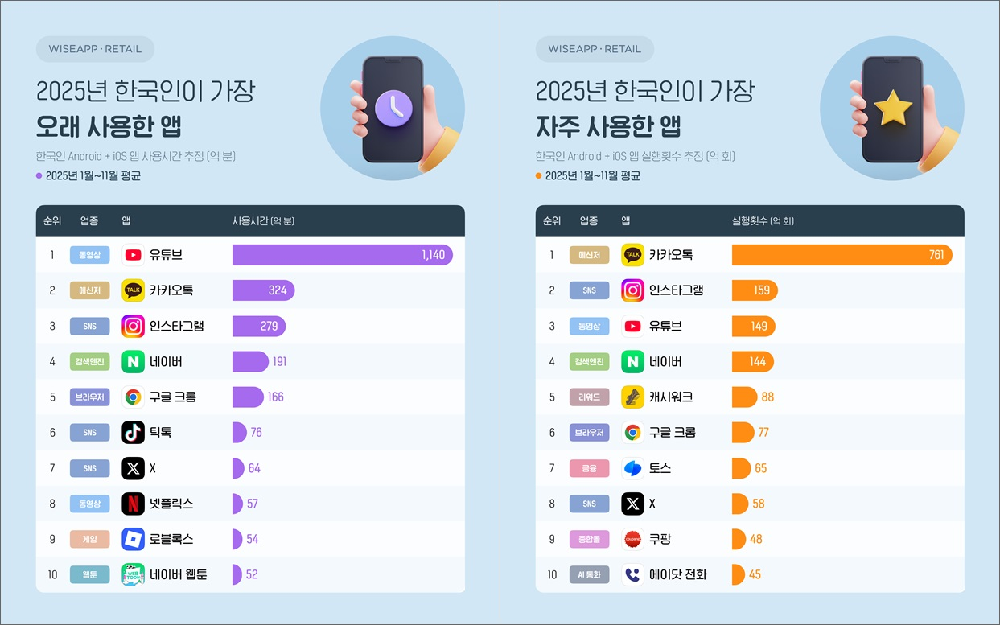

# (1/2) 프로젝트 제안서

## Members
* Student1 : [윤창길(팀장)](https://github.com/Spearoad)
* Student2 : 김동욱
* Student3 : 김진수
* Student3 : 조수현
* Student3 : 천성찬
* Student3 : 최현준 

## Objectives
* **Title:** 과도한 숏폼 시청 방지 및 도파민 디톡스 어플리케이션

## Background & Basic knowledge
* Android Studio 환경에서의 Kotlin 기반 애플리케이션 개발 및 디버깅 프로세스를 숙지하고 있다.
* Git과 GitHub를 활용한 형상 관리 및 브랜치(Branch) 기반의 원격 협업, 충돌(Conflict) 해결에 능숙하다.
* 안드로이드의 Accessibility Service(접근성 서비스) 작동 원리를 이해하고, 화면(UI Node)의 이벤트를 백그라운드에서 감지 및 제어할 수 있다.
* Firebase Firestore(NoSQL)의 구조를 이해하고, 커뮤니티 데이터(게시글, 유저 정보)의 실시간 읽기/쓰기(CRUD) 및 비정규화 처리 방식을 알고 있다.
* Gemini 등 LLM API를 활용한 프롬프트 엔지니어링 및 텍스트 카테고리 자동 분류 아키텍처를 구축할 수 있다.
* Google ML Kit의 Text Recognition 엔진을 활용한 온디바이스 OCR(문자 추출) 처리와 텍스트 정제 기법을 이해하고 있다.

## Resource & Reading Material
* AccessibilityService API: 타사 앱(유튜브, 인스타그램 등)의 UI Node 계층 구조 탐색 및 뷰(View) 이벤트 감지 매뉴얼
* Cloud Firestore: NoSQL 기반의 데이터 모델링(Data Modeling) 및 커뮤니티 데이터 실시간 동기화(Realtime Updates) 구축 가이드
* Firebase Authentication: 안전한 유저 로그인 및 세션 관리 매뉴얼
* Kotlin Coroutines & Flow: DB 읽기/쓰기 및 차트 데이터 렌더링 시 메인 스레드(UI) 멈춤 현상을 방지하는 비동기 프로그래밍 문서 

## Preparation & Tool
* **S/W:** Android Studio, Firebase
* **API:** Google ML Kit, Gemini API

## Functions

### - 접근성 감지 및 화면 분석
1. YouTube, Instagram, Kakaotalk, Tiktok 앱 실행 및 숏폼 진입 여부를 고유 UI 구조 파악를 통해 정밀 감지
2. YouTube, Instagram, Kakaotalk, Tiktok 앱에서 숏폼 진입 시 이를 감지하여 시청 영상 수를 측정.
3. 동일 영상 체류 시 화면을 캡처하여 OCR을 통해 텍스트를 추출하고 불필요한 내용을 정제.

### - AI 영상 분류 및 사용자 점수 연산
1. 추출된 텍스트를 Gemini AI로 전송하여 영상의 카테고리(게임, 먹방 등)를 판별.
2. 사용자가 설정한 카테고리별 제한 우선순위에 따라 매일 초기화되는 도파민 점수(초기값 100)에서 점수를 연산.

### - 통계 제공
1. 수집된 AI 분류 시청 로그(DOPAMINE_LOG)를 바탕으로 앱별, 카테고리별 사용 비중을 차트로 시각화.
2. 사용자가 설정한 일일 한도 초과 및 수면 시간대에 사용한 내용을 강조 표시.
3. 기회비용(최저시급, 소모 칼로리 등) 환산 지표 제공.

### - 서버 및 커뮤니티
1. Firebase를 활용하여 커뮤니티 구축 및 동기화.
2. 앱 내 소그룹 모임방: '열품타' 모델을 벤치마킹하여 실시간 랭킹 및 칭호(대장/꼴찌) 부여.
3. 앱과 연동되는 웹 플랫폼으로, 유저의 '도파민 점수'에 따라 게시글/댓글 폰트 크기가 동적으로 제한됨.
4. 사용자의 사용 데이터와 커뮤니티 데이터를 기록.

## Project Schedule

| 날짜 | 수행 내용 |
| :--- | :--- |
| **3/15** | 프로젝트 주제 결정 |
| **3/20** | 제안서 작성 및 수정 |
| **4/1** | 제안서 발표 및 보완 |
| **~4/20** | DRD 작성 및 수정 |
| **~5/18** | DSD 작성 및 수정 |
| **~6/12** | 프로토타입 제작 및 발표 |

---

# (2/2) 설계 개요
## 1.1 개발 배경 및 동기

  

현재 모바일 미디어 환경은 유튜브 숏츠, 인스타그램 릴스, 틱톡과 같은 숏폼 콘텐츠를 중심으로 빠르게 재편되고 있다.
최근 카카오톡에서도 국민 채팅앱에서도 숏폼 콘텐츠를 추가하며 그 분위기를 더욱 쉽게 파악할 수 있으며, 2025년 기준 월 사용 1,140억 분을 기록할 정도로 매우 높은 체류시간을 보이고 있다. 이는 단순 앱의 사용으로만 기록한 것이며, 해당 플랫폼 모두 웹에서도 서비스를 지원하기 때문에 현대인이 디지털 미디어를 더 많이 사용하는 것으로 파악할 수 있다. 유튜브는 롱폼과 숏폼이 함께 포함된 플랫폼이지만, 숏폼만을 제공하는 미디어 플랫폼도 인스타그램은 279억 분, 틱톡은 76억 분의 높은 사용시간을 기록해 숏폼 중심의 소비 구조로 빠르게 확산되고 있음을 보여준다.

문제는 이 숏폼 콘텐츠가 1분 내외의 짧은 분량으로 가볍게 소비되는 인식과 다르게 실제로는 알고리즘의 추천을 통해 더 많은 숏폼 콘텐츠를 소비하도록 유도하기 때문에 사용자는 자신도 모르게 반복되는 자극적인 미디어 소비에 익숙해지고, 이는 수면 지연, 집중력 저하, 학습 부진, 정서적 피로와 같은 부정적인 경험을 경험할 가능성이 있다. OECD와 미국 보건당국, 최근 연구들 역시 과도한 스크린 사용과 소셜 미디어 이용이 수면 및 정신건강 문제와 연결될 수 있음을 지적하고 있다.

기존의 디지털 디톡스 앱에서는 이러한 문제를 해결하기 위해 앱 사용시간 제한 기능을 제공하고 있지만, 대부분 단순히 플랫폼 실행 자체를 차단하는 방식으로 정보 탐색, 학습, 소통 등 미디어 소비만을 위한 목적이 아닌 생산적인 목적에도 활용되기 때문에, 전체 차단은 오히려 사용자의 반발을 볼러올 수 있다. 따라서 필요한 것은 앱 전체를 막는 단순 차단이 아니라 실제 문제를 유발하는 과도한 자극적인 숏폼 콘텐츠 시청 행위를 정밀하게 감지하고, 사용자 스스로 제어할 수 있도록 유도하는 방식이다.

이러한 생각에서 출발한 **도파민 컷(Dopamine Cut)** 은 사용자의 미디어 플랫폼 실행 및 숏폼 시청을 감지하여 과도한 시청을 제한하고, 사용자 스스로 시청을 제어할 수 있도록 유도하여 지속 가능한 도파민 디톡스 어플리케이션이다.

## 1.2 개발 목표
**도파민 컷(Dopamine Cut)** 의 개발 목표는 단순히 특정 어플리케이션을 차단하는데 있지 않다. 본 서비스는 유튜브 숏츠, 인스타그램 릴스, 틱톡과 같이 사용자의 체류를 유도하는 숏폼 콘텐츠를 정밀하게 감지하고, 과도한 시청을 줄일 수 있도록 지원하는 것을 1차 목표로 한다. 이를 위해 단순힣 앱 전체 사용을 막는 방식이 아니라, 실제 문제를 유발하는 숏폼 시청을 선택적으로 제어하는 기능을 구현하고자 한다. 이는 프로젝트 구상안에서도 Accessibility Service를 활용해 플랫폼별 숏폼 뷰 진입을 감지하고, 사용자 스스로 설정한 시간/횟수 초과 시 부분적 제한을 수행하는 구조로 제시되어 있다.

두 번째 목표는 사용자가 자신의 미디어 소비 패턴을 직관적으로 인식할 수 있도록 시각화하는 것이다. 사용자가 스스로의 정확한 시청 시간을 파악하는 것은 추천 알고리즘을 통해 무의식적으로 지속적인 시청을 유도하여 힘들기 때문에, 본 서비스에서는 기간별 숏폼 시청 수, 시간대별 사용 시간, 앱별 사용 비율, 수면 시간대 방해 여부 등을 통계를 통해 제공하여 사용자가 자신의 사용 습관을 구체적으로 확인할 수 있도록 하는 것은 목표로 한다.

세 번째 목표는 단순한 경고를 넘어, 사용자가 스스로 행동 변화를 선택하도록 유도하는 것이다. 최근 연구와 공공기관 보고서는 과도한 소셜미디어 및 디지털 미디어 사용이 수면 문제, 불안, 우울, 집중 저하, 학습 부진과 연결될 수 있다고 지적하고 있다. 도파민 컷은 이를 바탕으로 사용 시간을 단순 수치로만 파악하게 하는 것이 아니라, 해당 시간을 최저 시급, 운동량, 학습량 등 기회비용의 형태로 환산하여 사용자에게 더 직접적으로 파악하는 서비스를 제공하고자 한다. 이는 사용자의 죄책감을 유발하는 기능이 아니라, 자신의 시간을 다른 가치 있는 활동과 비교해보도록 만드는 자기 성창 도구로써 의미를 가진다.

마지막으로 도파민 컷의 궁극적인 개발 목표는 일시적인 사용 억제가 아니라 지속 가능한 디지털 디톡스 습관 형성이다. 이를 위해 사용자의 데이터가 없는 초기 실행 시 자가진단을 통해 맞춤형 디톡스 방안을 제공하고, 이후 사용자의 앱 사용 데이터, 수면 시간대 분석을 기반으로 해서 동일한 목적을 가진 커뮤니티를 통해 집단 동기부여를 형성하고, 목표 달성시 보상과 커뮤니티 공유 등 장기적인 참여를 유도하는 구조를 포함한다. 즉 도파민 컷은 사용자가 자신의 미디어 소비를 이해하고 조절하면서 건강한 미디어 이용 습관을 형성하도록 돕는 개인별 맞춤 서비스를 지향한다.

## 1.3 시스템 기능
### - 숏폼 감지 및 시청 제한 기능
도파민 컷의 핵심 기능은 사용자의 미디어 콘텐츠 플랫폼의 사용 시간을 추적하고, 숏폼 시청 수를 파악하는 기능으로, 이를 위해 Accessibility Service 기반의 감지 구조를 활용하며, 단순히 앱 전체를 차단하는 것이 아니라 일부 숏폼 시청만 선택적으로 감지하고 제어하거나 현재 얼마나 시청중인지 파악하게끔 알림을 통해 확인시킴으로써 생산적인 목적으로 사용하는 것은 유지하면서도 과도한 시청만을 줄일 수 있는 점에서 기존 앱 차단 방식과 차별된다. 

### - 시청 기록 시각화 기능
도파민 컷은 사용자의 시청 데이터를 수집하고 이를 직관적으로 시각화하는 통계 기능을 제공한다. 주요 항목으로는 기간별 숏폼 시청 수, 시간대별 사용 시간, 앱별 사용 비율, 수면 시간대 방해 여부 등이 있으며, MPAndroidChart를 활용한 차트  기반 UI를 게획하고 있다. 또한 사용자 시청 데이터를 통해 도파민 점수를 제시하고, 이의 점수 변화에 대한 그래프와 목표를 달성한 날짜에 체크 표시가 남는 캘린더도 포함되어 있어 사용자가 자신의 미디어 소비 패턴과 변화 추이를 한 눈에 파악할 수있도록 한다. 

### - 개인 맞춤형 알림 메세지 및 기회비용 환산 기능 
도파민 컷은 사용자가 본인의 사용 시간을 체감하기 쉬운 방식으로 환산하여 경각심을 주는 기능을 포함한다. 수면 시간대나 수면 시간 전에 앱 실행 시 별도의 경고 메세지를 제공하도록 설게되어 있다. 또한 무의식적으로 스크롤한 시청 시간을 최저시간 수입, 운동 소모 칼로리, 독서 및 공부 시간 등으로 바꾸어 보여주는 기회비용 환산 기능을 제공함으로써, 사용자가 소비한 시간을 보다 현실적인 가치로 인식할 수 있도록 한다. 예를 들어 "이 시간 동안 운동했다면 ~~칼로리를 소모할 수 있었습니다"와 같은 형태의 메세지를 제시하는 구조이다.

### - 앱 내 소그룹 모임방 기능
열품타(열정을 품은 타이머) 앱을 벤치마킹하여 소그룹 모임방을 제공한다. 방 내부에서는 멤버들 간의 당일 도파민 잔여 점수 기준 실시간 랭킹이 제공되며, 자정 정산 결과에 따라 대장, 꼴찌 등의 칭호와 하위 유저 알림 권한('찌르기')이 부여된다.

### - 커뮤니티 및 사용자 관리 기능
도파민 컷은 일반 사용자 기능 외에도 운영 및 관리 기능 또한 설계하였다. 관리자 측에서는 게시글과 댓글을 삭제 및 유저의 신고 내용을 확인하여 재재가 필요한 사용자에게 일정 시간 단위의 커뮤니티 활동 정지 처분을 하도록 하여, 해당 사용자는 글 작성, 댓글 작성, 추천 기능이 제한된다.

### - 개인 맟춤 설정 기능
도파민 컷은 사용자마다 사용 시간과 통제 기준이 다르다는 점을 고려하여 개인 맞춤 설정 기능을 포함한다. 사용자가 자신의 생활 패턴에 맞춰 디지털 디톡스 강도를 조절할 수 있도록 지원하는 방향을 지향한다

## 1.4 설계 제한사항
### 1) 경제적 제한사항
본 시스템은 사용자 정보뿐만 아니라 커뮤니티 활동을 기록 및 저장하는데 Firebase를 활용하므로, 사용자가 늘어날수록 서버 비용이 증가한다. 무료로 제공되는 범위는 저장 데이터 1GB, 문서 읽기 1일 50,000회, 쓰기 1일 20,000회로 제한된다. 따라서 초기에는 저비용 구조로 운영할 수 있으나, 상용화 단계에서는 사용량 증가에 따른 운영비를 반드시 고려해야 한다.
또한 Gemini API, OCR 모델등 외부 모델을 사용함으로써, 트래픽 증가 시 API 호출 비용이 발생한다.

### 2) 환경적 제한사항
본 시스템은 안드로이드 전용으로 개발 및 설계되어, iOS 등 다른 모바일 운영체제에서는 활용할 수 없다. 특히 핵심 기능인 숏폼 감지에 대한 부분은 안드로이드의 Accessibility Service를 활용하는 방식으로, 운영체제 버전, 플랫폼 앱 UI 구조의 변화에 따라 정확도가 달라질 수 있다. 또한 지속적으로 앱 실행을 감지해야하는 시스템 특성상, 안드로이드는 배터리 절약을 위해 백그라운드 동작을 제한하며, 이 경우 사용자가 해당 서비스를 원활하게 경험하지 못할 수 있다. 따라서 이 시스템은 특정 OS와 실행 환경에 강하게 의존하며, 저전력 및 백그라운드 최적화 설계가 필수적이다. 

### 3) 사회적 제한사항
본 시스템은 디지털 디톡스와 자기 통제를 돕는 목적을 가지지만, 사용자에 따라서 과하게 통제받는다는 부정적인 인식을 가질 수 있다. 특히 커뮤니티의 챌린지 기능이 지나치게 경쟁 요소로 소비되거나, 디지털 사용 습관을 공개적으로 비교되어 오히려 스트레스를 유발할 가능성도 있다. 따라서 시스템 설계 시 기록 공유를 강제하지 않고, 비교 중심보다는 자기 개선 중심의 기능으로 개발해야 하며, 커뮤니티 역시 정보 공유, 응원 등 긍정적인 분위기가 중심으로 운영되어야 한다.

### 4) 보안적 제한사항
본 시스템은 사용자의 시청 기록, 앱 사용 기록을 다루기 때문에 정보보안과 사용자 안전을 최우선으로 고려해야 한다. 특히 로그인 및 사용자 데이터 저장 기능이 포함되므로 Firebase Security Rules의 최소 권한 원칙, 암호화 전송, 계쩡 보호 기능을 등을 적용하여 데이터 유출과 오남용 위험을 줄여야 한다.

### 5) 정책 준수 제한사항
본 시스템이 실제 배포를 위해서는 안드로이드 및 Google Play 생태계의 표준과 정책을 충족해야만 한다. 사용자의 활동을 추적하는 Accessibility API 사용 앱은 Play Console의 권한 선언과 검토 절차를 거쳐야 하고, 데이터 수집 여부와 보안 처리 방식은 Data safety 양식에 정확히 기재되어야 한다. 또한 UI는 Android Core App Quality와 Material Design 기준을 따르는 것이 바람직하며, 보안 측면에서는 OWASP MASVS 같은 모바일 보안 표준을 준수하는 것이 요구된다. 즉 도파민 컷은 정책 적합성, 품질 및 보안 기준을 동시에 충족하느 시스템이여야 한다.

## 1.5 Specification
#### [표 1] 스마트폰 어플리케이션 사양
| 기능 | 상세 기능 | 상세 설명 |
| :--- | :--- | :--- |
| **운영 체제** | **Android** | - 버전 : Android 10.0 (API 29) 이상 권장 |
| **핵심 감지** | **접근성 서비스** | - 감지 대상 : YouTube Shorts, Instagram Reels, TikTok, Kakao 동영상 탭 - 감지 기준 : 특정 UI Node 진입 후 5초 이상 지속 체류 시 시청으로 간주 - 반응 속도 : 진입 이벤트 감지 후 1초 이내 로직 실행 |
| **AI 연산** | **카테고리 분류** | - 모델 연동 : Gemini API 전송 |
| **차단 및 제어** | **오버레이** | - 차단 방식 : 시스템 최상단 윈도우(Overlay) 활성화를 통한 화면 가리기 - 권한 : '다른 앱 위에 표시(Appear on top)' 권한 필수 사용 |
| **알림 시스템** | **알림 설정** | - 알림 종류 : 푸시 알림, 진동, 팝업창 메시지 송출 - 기회비용 알림 : 시청 시간을 최저시급(9,860원/h) 및 칼로리로 환산 표기 - 알림 반응 속도 : 목표 시간 초과 즉시 발생 (5초 이내) |
| **데이터 동기화**| **무선 인터넷** | - 접속 방식 : Wi-Fi IEEE 802.11 b/g/n (2.4GHz) 또는 LTE/5G - 동기화 주기 : 앱 실행 및 게시글 작성 시 Firebase 실시간 동기화 |
| **사용자 인증** | **로그인** | - 인증 방식 : Firebase Google Auth 연동 - 유저 정보 : UID 기반 닉네임, 중독 등급, 누적 시청 데이터 관리 |

#### [표 2] 통계 시각화 및 커뮤니티 사양
| 기능 | 상세 기능 | 상세 설명 |
| :--- | :--- | :--- |
| **시각화** | **데이터 차트** | - 라이브러리 : MPAndroidChart 활용 - 그래프 종류 : 주간 사용량(막대), 앱별 비중(파이), 24시간 추이(라인) |
| **커뮤니티** | **서버(DB)** | - 데이터베이스 : Firebase Cloud Firestore (NoSQL) - 처리 속도 : 데이터 읽기/쓰기 응답 시간 3초 이내 보장 |
| **모임방 관리** | **실시간 동기화** | - 구조 : Firebase Firestore 기반 방장, 멤버 매핑 (ROOM_MEMBER) |

---
