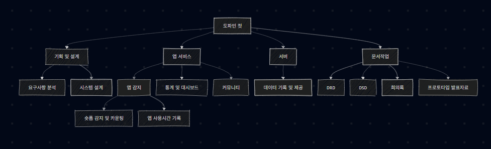

# (1/2)요약문(Executive Summary)

---

# (2/2)프로그램 수행계획
## Work Breakdown 차트

  

도파민 컷은 크게 기획 및 설게, 앱 서비스, 서버, 문서작업으로 구분된다.
기획 및 설계 영역은 프로젝트의 방향을 설정하고 전체 구조를 구체적으로 작성하는 단계로, 요구사항 분석과 시스템 설계로 세분화된다.
요구사항 분석에서는 숏폼 감지, 사용시간 기록, 통계 제공, 커뮤니티 기능 등 핵심 기능을 정리하고, 시스템 설계에서 이를 실제로 구현하기 위한 클래스와 함수 구조를 설계하는 작업을 수행한다.

앱 서비스 영역에서는 사용자가 직접 이용하는 핵심 기능으로 구성되며, 앱 감지, 통계 및 대시보드, 커뮤니티로 나뉜다. 사용자의 숏폼 시청 행위와 앱 사용 패턴을 기록 및 추적하는 핵심 역할을 담당한다.
통계 및 대시보드는 기록된 데이터를 시각적으로 제공하여 사용자가 자신의 미디어 소비 습관을 파악할 수 있도록하고, 커뮤니티 기능은 사용자 간 정보 공유와 상호 작용을 지원한다.

서버 영역은 앱에서 생성되는 데이터를 저장하고 관리하며 필요한 정보를 제공하는 역할을 담당한다. 본 프로젝트에서는 이를 데이터 기록 및 제공으로 정의하였다. 마지막으로 문서 작성 영역은 프로젝트 수행 과정과 결과를 정리하기 위한 작업으로, DRD, DSD, 회의록, 프로토타입 발표자료 작성으로 구성된다.

## Gantt 차트
## Linear Responsibility 차트
