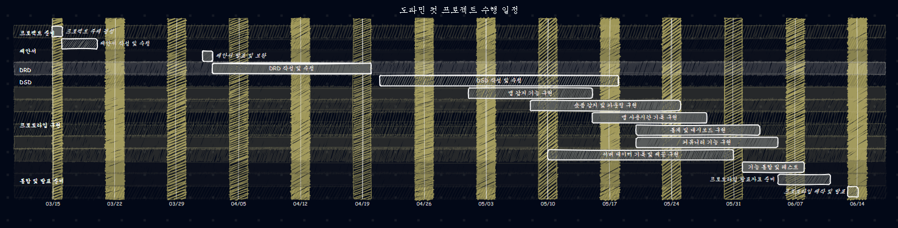

# (1/2)요약문(Executive Summary)
## 1. 시장 환경 및 문제 인식
현재 모바일 미디어 환경은 유튜브 쇼츠, 인스타그램 릴스, 틱톡 등 **숏폼 콘텐츠**를 중심으로 빠르게 재편되고 있습니다. 
* 2025년 기준 월 사용 시간이 1,140억 분에 달할 정도로 체류 시간이 깁니다. 
* 알고리즘 추천에 의한 무의식적인 과도한 시청은 수면 지연, 집중력 저하, 팝콘 브레인 현상 등 부정적인 결과를 초래하고 있습니다. 

이에 따라 스마트폰 과의존 문제를 해결하려는 **'디지털 웰빙'** 및 **'도파민 디톡스'** 시장 수요가 전 세계적으로 매년 13.5%의 높은 성장률을 보이며 급부상하고 있습니다.

## 2. 기존 솔루션의 한계와 '도파민 컷'의 새로운 시도
기존의 디지털 디톡스 애플리케이션들은 단순히 앱 전체의 실행을 차단하는 1차원적인 방식을 취하여, 정보 탐색 등 생산적인 목적의 활용마저 제한하는 유연성의 한계가 존재했습니다.

**'도파민 컷(Dopamine Cut)'**은 이러한 한계를 극복하기 위해 다음과 같은 차별화된 솔루션을 제공합니다.
* **선택적 숏폼 제어**: 안드로이드의 접근성 서비스(Accessibility Service)를 활용하여 앱 내부의 숏폼 진입 이벤트만을 정밀하게 감지하고 선택적으로 제어합니다.
* **직관적인 기회비용 시각화**: 사용자에게 시청 시간을 단순한 숫자가 아닌 '최저시급', '소모 칼로리' 등 직관적인 기회비용으로 환산하여 제공합니다.
* **소셜 디톡스 환경 구축**: Firebase 기반의 실시간 커뮤니티와 챌린지 기능을 통해 사용자 간 긍정적인 상호작용과 집단 동기부여를 이끌어내어 지속 가능한 디지털 디톡스 습관 형성을 돕습니다.

## 3. 타겟 시장 및 비즈니스 전망
이러한 차별화된 기능을 바탕으로 통제력이 필요한 청소년부터 생산성 향상을 원하는 대학생 및 직장인까지 폭넓은 타겟층을 공략합니다.

* **예상 사용자 확보**: 출시 1년 차에 약 **80만에서 120만 명**의 다운로드를 확보할 수 있을 것으로 기대됩니다.
* **예상 수익 모델**: 보상형 광고 시청을 기반으로 한 무료 모델과 정기 결제를 통한 프리미엄 구독 모델을 병행합니다.
* **예상 매출액**: 연간 약 **28억 원에서 30억 원** 규모의 안정적인 수익이 창출될 것으로 예측됩니다.

---

# (2/2)프로그램 수행계획
## Work Breakdown 차트

  

도파민 컷은 크게 기획 및 설게, 앱 서비스, 서버, 문서작업으로 구분된다.
기획 및 설계 영역은 프로젝트의 방향을 설정하고 전체 구조를 구체적으로 작성하는 단계로, 요구사항 분석과 시스템 설계로 세분화된다.
요구사항 분석에서는 숏폼 감지, 사용시간 기록, 통계 제공, 커뮤니티 기능 등 핵심 기능을 정리하고, 시스템 설계에서 이를 실제로 구현하기 위한 클래스와 함수 구조를 설계하는 작업을 수행한다.

앱 서비스 영역에서는 사용자가 직접 이용하는 핵심 기능으로 구성되며, 앱 감지, 통계 및 대시보드, 커뮤니티로 나뉜다. 사용자의 숏폼 시청 행위와 앱 사용 패턴을 기록 및 추적하는 핵심 역할을 담당한다.
통계 및 대시보드는 기록된 데이터를 시각적으로 제공하여 사용자가 자신의 미디어 소비 습관을 파악할 수 있도록하고, 커뮤니티 기능은 사용자 간 정보 공유와 상호 작용을 지원한다.

서버 영역은 앱에서 생성되는 데이터를 저장하고 관리하며 필요한 정보를 제공하는 역할을 담당한다. 본 프로젝트에서는 이를 데이터 기록 및 제공으로 정의하였다. 마지막으로 문서 작성 영역은 프로젝트 수행 과정과 결과를 정리하기 위한 작업으로, DRD, DSD, 회의록, 프로토타입 발표자료 작성으로 구성된다.

## Gantt 차트

  

도파민 컷 프로젝트의 Gantt 차트는 프로젝트 주제 결정 이후 제안서, DRD, DSD, 프로토타입 구현 순으로 진행된다. 먼저 3월 중 프로젝트 주제를 확정하고 제안서를 작성 및 수정한 뒤, 4월 1일 제안서 발표 및 보완을 수행한다. 이후 4월 20일까지 DRD를 작성하고 수정하며, 5월 18일까지 DSD를 작성 및 보완한다. 프로토타입 구현은 DSD 작성 단계와 일부 병행하여 진행하며, 앱 감지 기능, 숏폼 감지 및 카운팅, 앱 사용시간 기록, 통계 및 대시보드, 커뮤니티, 서버 데이터 기록 및 제공 기능을 순차적으로 구현한다. 마지막으로 6월 초 최종 테스트를 수행하고, 발표자료를 준비한 후 6월 12일까지 프로토타입 제작 및 발표를 최종 목표로 한다.

## Linear Responsibility 차트

본 프로젝트의 효율적인 완수를 위해 팀원별 전문성을 바탕으로 역할을 분담하며, 각 모듈별 책임 소재를 다음과 같이 정의합니다.

| 업무 구분 | 세부 활동 내용 | 윤창길 | 김동욱 | 김진수 | 천성찬 | 조수현 | 최현준 |
| :--- | :--- | :---: | :---: | :---: | :---: | :---: | :---: |
| **1. 기획 및 분석** | 요구사항 정의 및 제안서 작성 | 1 | 2 | 2 | 2 | 2 | 2 |
| | 시스템 상세 사양(Spec) 확정 | 1 | 2 | 2 | 2 | 2 | 2 |
| **2. 숏폼 감지 모듈** | Accessibility Service 로직 구현 | 3 | 1 | 1 | 1 | 3 | 3 |
| | 앱별 UI Node 계층 분석 및 감지 | 3 | 1 | 1 | 1 | 3 | 3 |
| | 시청 시간 측정 및 카운팅 알고리즘 | 3 | 1 | 1 | 1 | 3 | 3 |
| **3. 서버 및 DB** | Firebase Firestore 데이터 스키마 설계 | 1 | 3 | 3 | 3 | 3 | 3 |
| | 유저 인증 및 커뮤니티 CRUD 구현 | 1 | 3 | 3 | 3 | 3 | 3 |
| **4. 개인화 서비스** | 알림 시스템(Push/Overlay) 구축 | 2 | 3 | 3 | 3 | 1 | 1 |
| | MPAndroidChart 활용 통계 시각화 | 2 | 3 | 3 | 3 | 1 | 1 |
| **5. 클라이언트** | 메인 UI 및 온보딩 페이지 구현 | 2 | 2 | 2 | 2 | 1 | 1 |
| **6. 프로젝트 관리** | 주간 회의 주관 및 일정 관리 | 1 | 3 | 3 | 3 | 3 | 3 |
| | 각종 보고서(DRD/DSD) 최종 취합 | 1 | 3 | 3 | 3 | 3 | 3 |

 

**※ 역할 지표 가이드 (예시 기준):**
* **1**: 책임자 (Main Responsibility) - 해당 업무의 의사결정 및 최종 완수 책임
* **2**: 보조책임자 (Sub Responsibility) - 업무 실행 지원 및 책임자 부재 시 대행
* **3**: 도움 (Support) - 필요 시 자료 조사 및 기술적 지원
