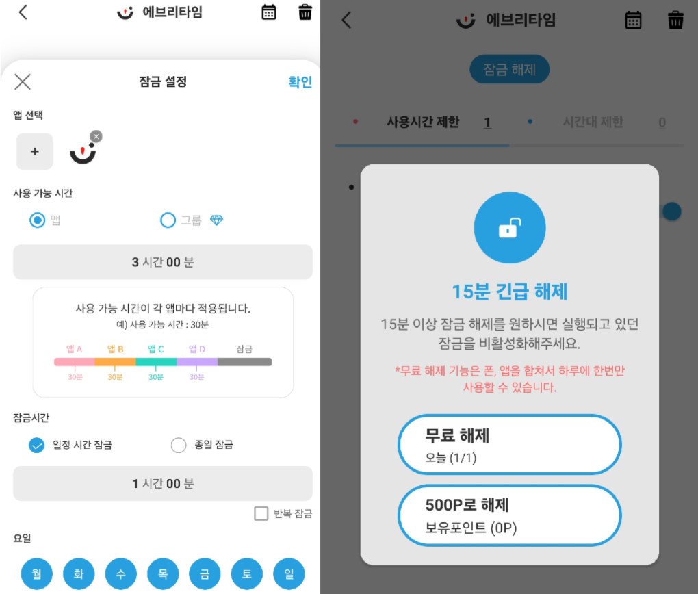
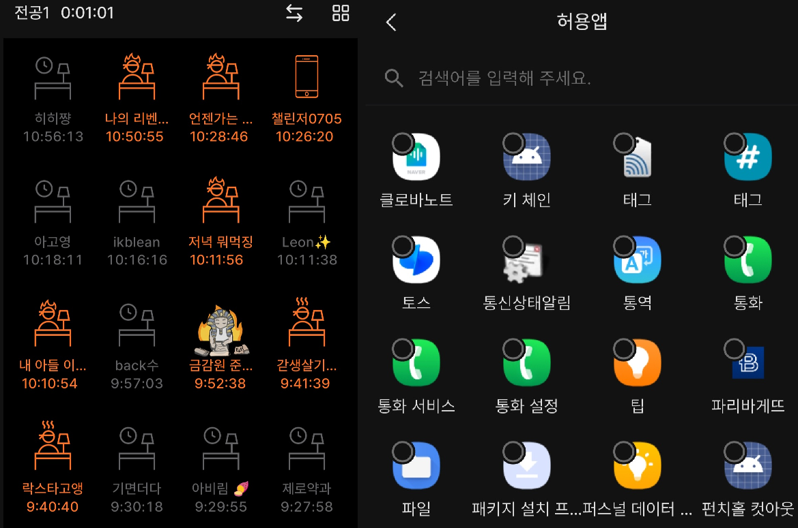
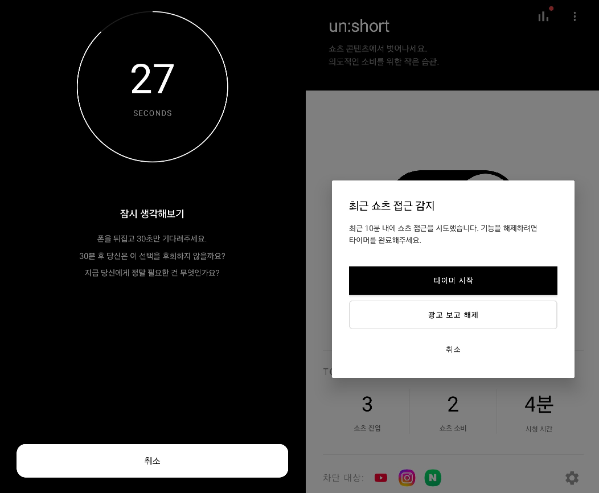
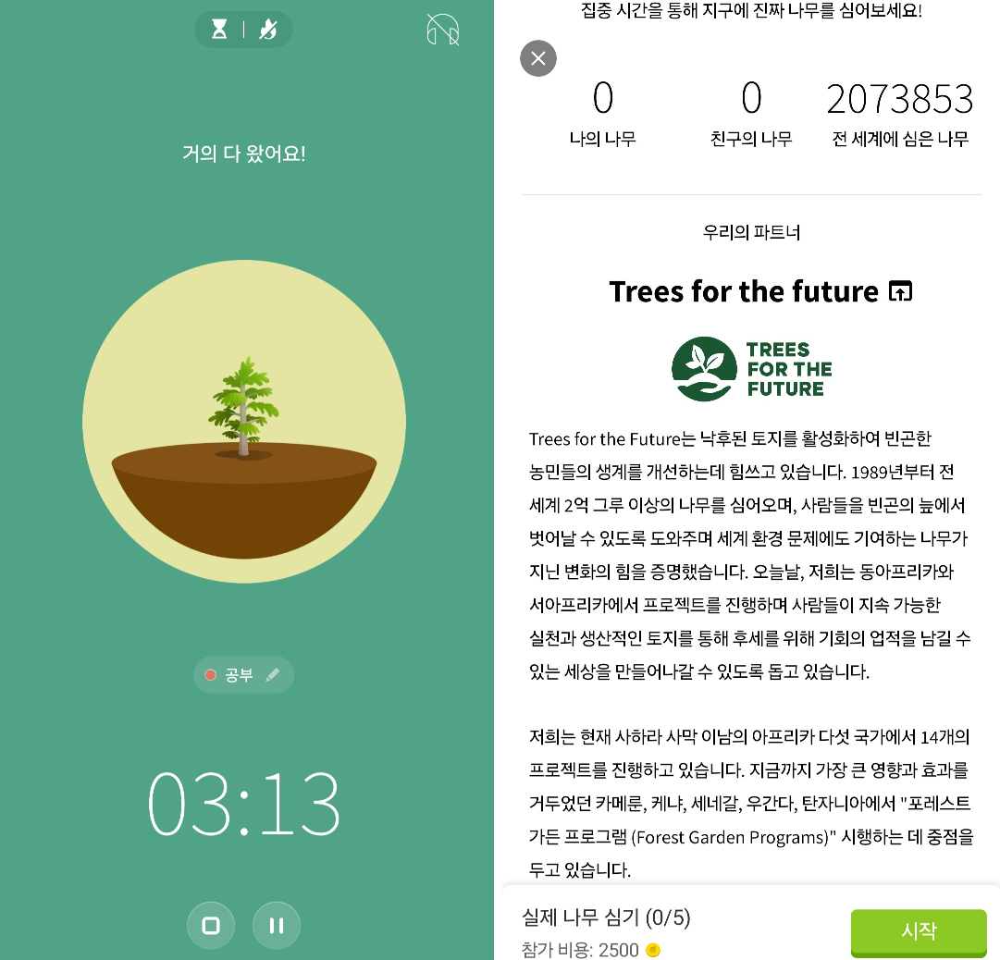
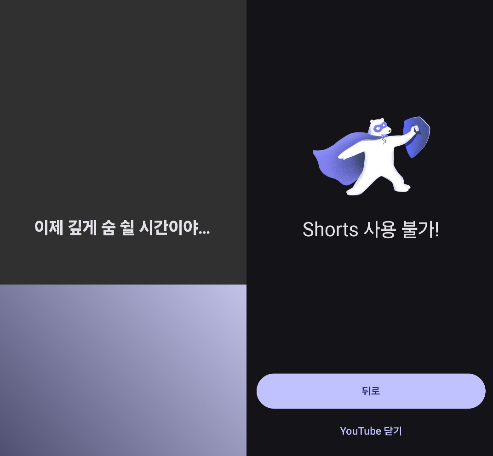
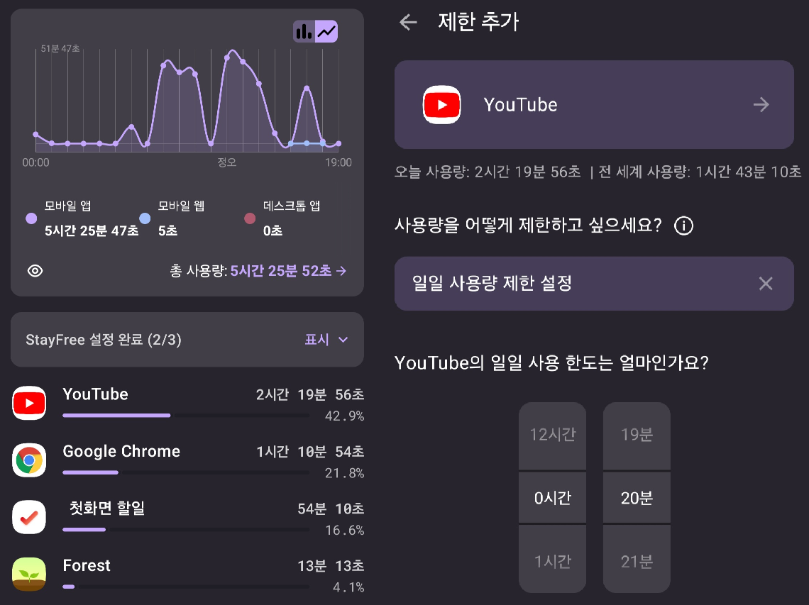

# 경쟁 제품 분석
현재 디지털 디톡스 및 스마트폰 사용 시간 관리 앱 시장에는 다양한 제품이 출시되어 있으나, 대부분의 애플리케이션이 '앱 전체 차단'이라는 일차원적인 접근 방식을 취하고 있다.

## **3.1. 국내 시장 서비스 분석**

### **3.1.1. 넌얼마나쓰니**
**주요 강점**: 사용자가 'n분 사용 후 m분 동안 잠금' 방식으로 본인의 생활 패턴에 맞춰 스마트폰 사용 및 휴식 주기를 직접 커스터마이징할 수 있다. 또한 '습관 만들기' 기능과 같은 하루의 목표를 계획하고 점검하는 투데이 플래너 역할을 지원하여 규칙적인 생활 습관 형성하는데 긍정적인 가이드를 제공한다.

**한계점 및 아쉬운 점**: 앱 잠금이라는 강력한 통제력을 제공하지만, 앱 잠금 해제 방식은 포인트 소진이라는 과금형 구조라는 점에서 자발적인 인지 개선보다는 강제성에 의존하는 경향이 있다. 또한, 애플리케이션 전체를 차단하는 1차원적인 하드 블로킹 방식으로 인하여 학습 및 정보 탐색 등의 생산적 목적의 앱까지 제한되는 유연성의 한계가 존재한다.

 

  
   
  [그림 1] 넌얼마나쓰니: 시간 설정 및 잠금 해제

### **3.1.2. 열정 품은 타이머**
**주요 강점**: 허용된 앱 외의 접근을 차단하는 기능과 함께, 스터디 그룹 단위의 실시간 접속 여부 및 랭킹 시스템을 제공하여 커뮤니티 기반의 강력한 집단 동기부여와 선의의 경쟁 심리를 유도하는 데 매우 성공적인 케이스의 애플리케이션이다.

**한계점 및 아쉬운 점**: 서비스의 본질적인 타겟이 '수험생 및 학습생'에 집중되어 있어 일상적인 디지털 디톡스용으로 사용하기에 진입 장벽이 존재한다. 특히 인터넷 강의 시청을 위해 유튜브를 허용(화이트리스트)할 경우, 앱 내부에서 알고리즘으로 재생되는 숏폼 시청은 세밀하게 제어가 할 수 없다는 기술적 제약이 아쉬운 부분이다.

 

  
   
  [그림 2] 열정 품은 타이머: 실시간 접속 여부 및 허용 앱 설정

### **3.1.3. un:short**
**주요 강점**: '쇼츠' 및 '릴스' 등 숏폼 콘텐츠 진입 상황을 특정하여 감지하고, 기기 화면을 뒤집어 30초의 대기 시간을 부여함으로써 무의식적인 시청 습관을 끊어내는 데 효과적이다. 만약 사용자가 쇼츠 접근 후 편한 시청을 위해 앱의 차단 기능을 강제로 종료하려고 시도할 경우, 오히려 '60초 대기'라는 더 긴 페널티를 부여하여 손쉬운 회피를 방지하는 이중 제어 기능이 돋보인다.

**한계점 및 아쉬운 점**: 단기적인 행동 제어에는 탁월하지만, 단순한 대기 시간 부여만으로는 사용자의 본질적인 습관 변화까지 이끌어내기는 어렵다. 사용자가 30초/60초의 불편함을 감수하고 시청을 강행한다면 이를 제어할 추가적인 기능이 없으며, 행동 교정을 장기적으로 유지하게 만드는 심리적 보상이나 데이터 피드백 루프가 부족하다는 점이 한계점으로 꼽힌다.

 

  
   
  [그림 3] un:short: 실제 패널티 요소 및 이중 제어

## **3.2. 국외 시장 서비스 분석**

### **3.2.1. Forest**
**주요 강점**: 스마트폰을 사용하지 않는 시간 동안 가상의 나무를 키우거나 꾸미는 게이미피케이션 요소를 채택하였고, ‘초집중‘ 모드를 이용한 화이트리스트를 기반으로 한 접근 통제는 사용자에게 강력한 몰입 환경을 제공한다. 특히, 집중을 통해 모은 포인트를 '실제 나무 심기 캠페인'과 연계하여, 환경 보호라는 사회적 가치를 창출하는 매우 강력하고 긍정적인 동기부여를 제공한다.

**한계점 및 아쉬운 점**: 애플리케이션 단위의 1차원적인 허용 및 차단 단위에 머물러있어, 앱 내부의 구체적인 콘텐츠 소비 맥락을 판별하지 못한다. 
예를 들어, 개념 학습이나 정보 탐색을 위해 유튜브를 화이트리스트에 추가할 경우 자극적인 숏폼 알고리즘에 무방비로 노출되며, 반대로 유튜브를 차단할 경우 필수적인 정보 탐색까지 가로막히는 유연성의 한계점이 발생한다.

 

  
   
  [그림 4] Forest: 실사용 화면 및 실제 나무 심기 캠페인 기부 화면

### **3.2.2. One sec**
**주요 강점**: 앱을 실행할 때 10초 내외로 의도적인 지연 시간을 주어 무의식적인 앱 실행 습관을 방지한다. 즉각적인 도파민 보상을 지연시키고 심호흡을 유도함으로써, 사용자에게 “지금 당장 이 앱을 써야할 이유가 있을까?”와 같은 스스로의 충동을 인지할 수 있는 심리적 여유를 제공하는 기획이 돋보인다. 또한, '쇼츠' 및 '릴스' 등 특정 숏폼 탭에 대한 '완전 차단' 기능을 별도로 제공하여, 숏폼 콘텐츠에 한해서도 강력한 통제력을 보여준다.

**한계점 및 아쉬운 점**: 충동을 제어하는 시점이 '앱 진입 시점'에 국한되어 있다. 만약, 이를 무시하고 앱에 진입하게 되면 많은 알고리즘에 의해 무한정으로 숏폼을 스크롤하는 행위는 기술적으로 방어하지 못한다. 또한, 정보 탐색이나 생산적 목적을 가진 접근 시에도 예외 없이 대기 시간이 강제되기 때문에 사용자 경험 저하와 피로도를 유발하는 구조적인 한계가 있다.
무료 버전에서는 단 하나의 앱 또는 '쇼츠' 및 '릴스'를 차단/제어할 수 있으며 여러 앱을 동시에 제어하기 위해 플랜을 결제해야 하는 부분에서 범용성이 떨어진다.

 

  
   
  [그림 5] one sec: 실제 패널티 요소 및 쇼츠 감지

### **3.2.3. StayFree**
**주요 강점**: 백그라운드 프로세스를 통해 애플리케이션별 사용 시간을 패턴을 세밀하게 추적하고 통계화 및 시각화한다. 사용자 스스로 목표와 제한 시간을 유연하게 설정하여 모니터링할 수 있는 자기 주도적인 데이터 통계 기능을 훌륭하게 구현하였다.

**한계점 및 아쉬운 점**: 설정된 시간을 초과할 경우 앱의 실행 자체를 전면 차단하는 하드 블로킹 방식을 채택하고 있어 유연한 대처가 불가능하다.  이로 인해, 차단을 해제하기 위하여 사용자가 제한 시간을 반복적으로 수동 연장하는 회피성 패턴을 유발하여 결국 장기적인 사용성을 떨어뜨리는 약점이 존재한다.

 

  
   
  [그림 6] StayFree: 앱 사용 통계 및 일일 사용량 설정

## **3.3. '도파민 컷'만의 차별화 전략**
경쟁 제품들의 구조적 한계를 기술적으로 해결하기 위해 '도파민 컷'은 다음과 같은 3가지 핵심 전략을 수립한다.

### **3.3.1. 접근성 서비스(Accessibility) 기반의 선택적 숏폼 제어**
단순히 특정 앱의 실행 자체를 막아버리는 기존의 일차원적인 방식을 벗어나, 안드로이드의 Accessibility Service(접근성 서비스)를 활용하여 사용자가 보고 있는 현재 화면의 이벤트를 파악한다.

* 타사 앱(유튜브, 인스타그램 등) 내부에서 '쇼츠' 및 '릴스'와 같은 특정 UI 컴포넌트나 View 이벤트를 감지하여 제어 로직을 작동시킨다. 이를 통해 필수적인 정보 탐색과 무의식적인 도파민 소비를 기술적으로 구분하여 유연한 통제 환경을 제공한다.

### **3.3.2. 데이터 시각화를 통한 기회비용 피드백**
단순히 경고 알림(예: "1시간 사용했습니다")을 넘어서, 사용자가 소모한 시간을 현실적인 가치(기회비용)로 치환하여 시각화된 데이터를 제공한다.

* 사용자가 무의식적으로 소비한 '쇼츠' 및 '릴스' 등의 시청 시간을 '최저시급 환산액', '운동 소모 칼로리', '학습 가능 페이지 수' 등의 명확한 수치로 변환하여 제공한다. 이를 통해 자신의 행동이 초래한 기회비용을 직관적으로 인지할 수 있도록 함으로써 자발적인 행동 교정을 유도한다. 

### **3.3.3. Firebase 기반의 지속 가능한 소셜 디톡스 (커뮤니티 및 챌린지)**
개인의 의지에만 의존하는 기존 앱의 한계를 극복하기 위해 **Firebase**를 활용한 백엔드 실시간 연동으로 공동의 목표를 달성하는 디톡스 환경을 구축한다.

* **실시간 데이터 동기화**: Firebase Firestore를 활용하여 사용자의 소셜 디톡스 보상 현황을 실시간으로 공유한다. 이는 단순히 로컬 기록을 넘어서, 서버에서 관리되는 신뢰성을 가진 데이터를 바탕으로 하는 랭킹과 보상 시스템을 제공한다.

* **긍정적 상호작용 설계**: 챌린지 기능이 타인과의 지나친 경쟁 요소로만 소비되지 않도록 자기 개선 중심의 기능으로 개발한다.
또한 커뮤니티가 정보 공유 및 응원 등의 긍정적인 분위기로 운영되도록 하여 사용자 간의 유대감을 형성하고, 이를 바탕으로 장기적인 습관 형성을 유도한다.

## **3.4. 경쟁 제품 기능 분석 및 비교표**

  [표 1] 디지털 디톡스 제품 비교
    
  

종합하자면, <strong>'도파민 컷'</strong>은 타 제품들이 가지는 일차원적인 앱 차단 방식의 기술적 한계를 극복한 앱이다. 숏폼 콘텐츠에 대한 정밀한 제어와 소셜 커뮤니티 및 챌린지를 통한 보상 시스템을 결합함으로써, 사용자에게 지속 가능하고 자발적인 디지털 디톡스 환경을 제공한다.

## 7. 수행 방법

본 프로젝트는 안드로이드 기반의 숏폼 시청 감지 및 디지털 디톡스 지원 애플리케이션으로, 사용자의 앱 실행 시간과 숏폼 진입 여부를 감지하고, 이를 통계화하여 시각적으로 제공하며, 커뮤니티 기능까지 포함하는 구조로 설계한다. 특히 기존 앱 차단 방식과 달리 Accessibility Service를 이용하여 앱 내부의 숏폼 진입만 정밀하게 감지하고 선택적으로 제어하는 것을 핵심 개발 방향으로 한다. 또한 사용 기록은 로컬 저장소와 Firebase를 활용해 관리하고, 통계 대시보드와 커뮤니티 기능을 함께 제공하는 방식으로 구현한다.

### **7.1 설계 및 개발 환경

본 프로젝트는 Android Studio 환경에서 개발하며, 안드로이드 스마트폰에서 실행되는 모바일 애플리케이션과 Firebase 기반 서버 기능으로 구성한다. 사용자 단말에서는 앱 실행 시간 측정, 숏폼 감지, 제한 알림, 통계 확인, 커뮤니티 이용이 이루어지며, 서버 측에서는 사용자 기록 및 커뮤니티 데이터를 저장하고 동기화하는 역할을 수행한다. 프로젝트의 주요 기능은 접근성 서비스 기반 감지, 사용 기록 저장, 데이터 시각화, 커뮤니티 기능으로 구분된다.

① 모바일 애플리케이션 개발 환경
안드로이드 애플리케이션은 Android Studio를 이용하여 개발하며, 프로그래밍 언어는 Kotlin을 사용한다. 개발 초기에는 Android Emulator를 이용해 기본 UI와 기능을 검증하고, 이후 실제 안드로이드 단말기에서 접근성 서비스 동작, 백그라운드 실행, 앱 사용 감지 정확도 등을 테스트한다. 이 과정에서 YouTube, Instagram, TikTok, KakaoTalk 등 대상 앱에서 숏폼 진입 이벤트를 감지하도록 구현한다.

② 데이터 저장 및 서버 환경
앱에서 수집한 사용자별 사용 시간, 숏폼 시청 횟수, 제한 초과 여부, 통계 데이터, 커뮤니티 게시글 및 사용자 정보를 관리하기 위해 Firebase Firestore를 사용한다. 로그인 및 사용자 식별이 필요한 경우 Firebase Authentication을 연동하며, 실시간 데이터 동기화를 통해 커뮤니티와 통계 반영이 가능하도록 구성한다. 또한 사용자 기록 데이터는 즉시 서버에만 의존하지 않도록 필요 시 로컬 저장소(Room 또는 DataStore)를 함께 사용하여 앱의 안정성을 높인다.

③ 실행 및 테스트 환경
본 시스템은 안드로이드 전용으로 설계하며, 핵심 기능인 숏폼 감지는 안드로이드의 Accessibility Service에 의존한다. 따라서 운영체제 버전 차이, 대상 플랫폼의 UI 구조 변경, 배터리 최적화 정책에 따라 감지 정확도와 백그라운드 동작 안정성이 달라질 수 있으므로, 여러 기기와 OS 버전에서 반복적으로 테스트해야 한다. 또한 실제 배포를 고려할 경우 접근성 권한, 데이터 수집 고지, 보안 규칙 등을 함께 검토해야 한다.

### **7.2 설계 및 개발 도구

본 프로젝트의 설계 및 개발 도구는 앱 클라이언트, 백엔드/데이터 관리, 협업 및 형상 관리, UI 및 테스트 도구로 구분할 수 있다.

① 앱 클라이언트 개발 도구
- Android Studio : 전체 안드로이드 애플리케이션 개발
- Kotlin : 주요 비즈니스 로직 및 UI 구현
- XML / Jetpack 기반 UI 구성 요소 : 화면 레이아웃 설계
- Accessibility Service API : 앱 실행 및 숏폼 진입 감지
- Kotlin Coroutines / Flow : 비동기 데이터 처리 및 상태 관리

② 백엔드 및 데이터 관리 도구
- Firebase Firestore : 사용자 기록 및 커뮤니티 데이터 저장
- Firebase Authentication : 사용자 로그인 및 계정 관리
- Firebase Security Rules : 접근 권한 제어 및 데이터 보호
- Room 또는 DataStore : 로컬 설정값 및 임시 기록 저장

③ 통계 및 시각화 도구
- MPAndroidChart 또는 Android 차트 라이브러리 : 사용 시간 및 시청 통계 시각화
- Calendar UI 컴포넌트 : 목표 달성 날짜 및 사용 패턴 표시