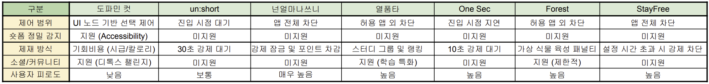

# 경쟁 제품 분석
현재 디지털 디톡스 및 스마트폰 사용 시간 관리 앱 시장에는 다양한 제품이 출시되어 있으나, 대부분의 애플리케이션이 '앱 전체 차단'이라는 일차원적인 접근 방식을 취하고 있다.

## 3.1. 국내 시장 서비스 분석

### 3.1.1. 넌얼마나쓰니
장점: 사용자가 'n분 사용 후 m분 동안 잠금' 방식으로 본인의 패턴에 맞춰 스마트폰 사용 및 휴식 주기를 직접 설정할 수 있다. 또한 '습관 만들기' 기능을 통해 하루의 목표를 계획하고 점검하는 투데이 플래너 역할을 지원하여 규칙적인 생활 습관 형성을 돕는다.

단점: 잠금 해제 시스템이 과금을 유도하는 구조로 설계되어 있어 사용자에게 피로감을 준다. 긴급 해제는 하루 단 1회, 특정 시간 동안만 제공되며, 이후 강제 잠금을 해제하려면 포인트를 지불해야 한다. 포인트는 무료 획득도 가능하지만, 제어가 필요한 앱이 많아질수록 더 많은 포인트가 요구되어 결국 결제를 유도하는 구조적 한계가 있다. 또한 가장 치명적인 단점은 애플리케이션 전체를 차단하는 1차원적 접근 방식이다. 유튜브 쇼츠나 인스타그램 릴스 등 특정 숏폼 진입만을 정밀하게 판별하는 기술이 없어, 정보 탐색 등 생산적 목적의 필수적인 앱 사용까지 원천 봉쇄해버린다.

### 3.1.2. 열정 품은 타이머
장점: 허용된 앱 외의 접근을 차단하는 기능과 함께, 스터디 그룹 단위의 실시간 접속 여부 및 랭킹 시스템을 제공하여 커뮤니티 기반의 강력한 집단 동기부여와 경쟁 심리를 성공적으로 유도한다.

단점: 서비스의 본질이 '수험생 및 학습'에 극단적으로 편향되어 있어 일상적인 디지털 디톡스용으로 사용하기에 진입 장벽이 높다고 볼 수 있다. 특히 앞서 설명한 Forest와 같이 인터넷 강의 시청을 위해 유튜브를 허용(화이트리스트)할 경우, 앱 내부에서 알고리즘으로 재생되는 숏폼 시청은 기술적으로 전혀 막아내지 못하는 구조적인 한계가 존재한다.

### 3.1.3. un:short 
장점: 유튜브 쇼츠나 인스타그램 릴스 등 숏폼 콘텐츠 진입 상황을 특정하여 감지하고, 화면을 뒤집어 30초의 대기 시간을 부여함으로써 무의식적인 시청 습관을 끊어내는 데 특화되어 있다. 또한 매우 직관적인 UI로 사용하기 굉장히 편리하다.

단점: 사용자의 앱 접근 및 시청 횟수 및 시간을 단순 기록하는 수준에 머무른다. 도파민 컷이 제공하는 '기회비용 환산(최저 시급, 운동량, 학습량 등)'과 같이 사용자의 인지적 행동을 논리적으로 자극하는 피드백 시스템과 커뮤니티 기반의 동기부여 요소의 부재가 단점이다. 따라서 사용자가 30초의 대기 시간을 감수하고서라도 숏폼을 시청하려 할 때, 이를 효과적으로 억제하고 장기적인 습관 개선으로 이끌어내기에는 한계가 명확하다.

## 3.2. 국외 시장 서비스 분석

### 3.2.1. Forest
장점: 스마트폰을 사용하지 않는 시간 동안 가상의 나무를 키우는 게이미피케이션 요소를 도입하여 긍정적인 동기 부여를 제공, ‘초집중‘ 기능을 설정하면 해당 시간 동안 화이트리스트에 없는 모든 앱의 접근이 차단할 수 있다.

단점: 애플리케이션 단위의 전면 허용 및 전면 차단만이 가능하여, 앱 내부의 구체적인 콘텐츠 소비 맥락을 판별하는 기능이 부재하다. 즉, 개념 학습이나 정보 탐색을 위해 유튜브를 화이트리스트에 추가할 경우, 생산적인 롱폼 영상 시청은 가능해지지만 동시에 자극적인 숏폼(쇼츠) 알고리즘에 무방비로 노출되는 취약점이 발생한다. 반대로 유튜브를 차단할 경우 도파민 중독은 막을 수 있으나 필수적인 학습 목적의 접근조차 원천 봉쇄되므로, 숏폼만 선택적으로 제어하지 못하는 한계가 존재한다.

### 3.2.2. One sec
장점: 특정 앱을 실행할 때 10초 내외로 의도적인 지연 시간을 주어 무의식적인 앱 실행 습관을 방지한다. 즉, 즉각적인 도파민 보상을 지연시키고 심호흡을 유도함으로써, 사용자에게 “지금 당장 이 앱을 써야할 이유가 있을까?”와 같은 자기 인지적 성찰을 할 시간을 주어 충동적인 미디어 소비를 효과적으로 억제한다.

단점: 앱 진입 시점 순간적인 충동만 제어할 뿐, 일단 앱에 진입하게 되면 많은 알고리즘에 의해 무한정으로 숏폼을 스크롤하는 행위 자체를 감지하거나 제어하는 기능은 없다. 또한, 정보 탐색이나 소통 등의 명확하고 생산성을 목적으로 하는 앱을 실행할 때도 무조건 10초를 기다려야 하는 사용성 저하와 피로도 문제를 발생시킨다.

### 3.2.3. StayFree
장점: 백그라운드 프로세스를 통해 애플리케이션별 사용 시간을 세밀하게 추적 및 통계화하며, 사용자 스스로 차단을 위한 제한 시간을 유연하게 설정할 수 있다.

단점: 제한 시간 초과 시 앱의 실행 자체를 전면 차단하는 하드 블로킹 방식을 취하고 있다. 이 기술은 학습이나 정보 탐색 등의 생산성의 목적으로 하는 접근까지 원천 봉쇄 해버린다. 그로 인해 차단을 해제하기 위하여 사용자가 제한 시간을 수동으로 연장하는 번거로운 행위를 반복적으로 유발하며, 이러한 반복적인 행위로 발생한 피로도는 결국 앱 삭제까지 이어지는 구조적 한계를 지니고 있다.

## 3.3. '도파민 컷'만의 차별화 전략
경쟁 제품들의 한계를 극복하기 위해 '도파민 컷'은 다음과 같은 3가지 핵심 차별화 전략을 내세운다.

### 3.3.1. 부분적 선택 제어 (정밀한 숏폼 감지)
앱 전체를 막는 단순 차단 방식에서 벗어나, 안드로이드의 Accessibility Service를 활용해 UI Node의 이벤트를 백그라운드에서 감지 및 제어한다.

이를 통해 사용자가 유튜브나 인스타그램 앱 내에서 '생산적인 롱폼 영상'을 보는지, '과도하게 자극적인 숏폼 릴스/쇼츠'에 진입했는지를 정밀하게 구분하여 숏폼 시청만을 선택적으로 감지하고 제한한다.

### 3.3.2.  기회비용 환산 기반의 인지 행동 치료적 접근
단순한 경고 알림(예: "1시간 사용했습니다")을 넘어서, 무의식적으로 소비한 숏폼 시청 시간을 '최저시급', '운동 소모 칼로리' 등 현실적인 가치로 인식할 수 있는 기회비용 수치로 환산하여 제공한다. 

이는 사용자의 자발적인 행동 변화를 이끌어내는 강력한 인지적 자극제가 될 수 있다.

### 3.3.3. 지속 가능한 소셜 디톡스 (커뮤니티 및 챌린지)
개인의 의지에만 의존하지 않도록 Firebase 기반의 실시간 커뮤니티와 챌린지 기능을 연동한다. 

집단 동기부여와 도파민 점수(배지) 보상 시스템을 통해 도파민 컷은 단순한 통제 수단을 넘어, 보상과 유대감을 바탕으로 하여금 장기적인 디톡스 습관 형성을 유도할 수 있다.

## 3.4. 경쟁 제품 기능 분석 및 비교표

  

