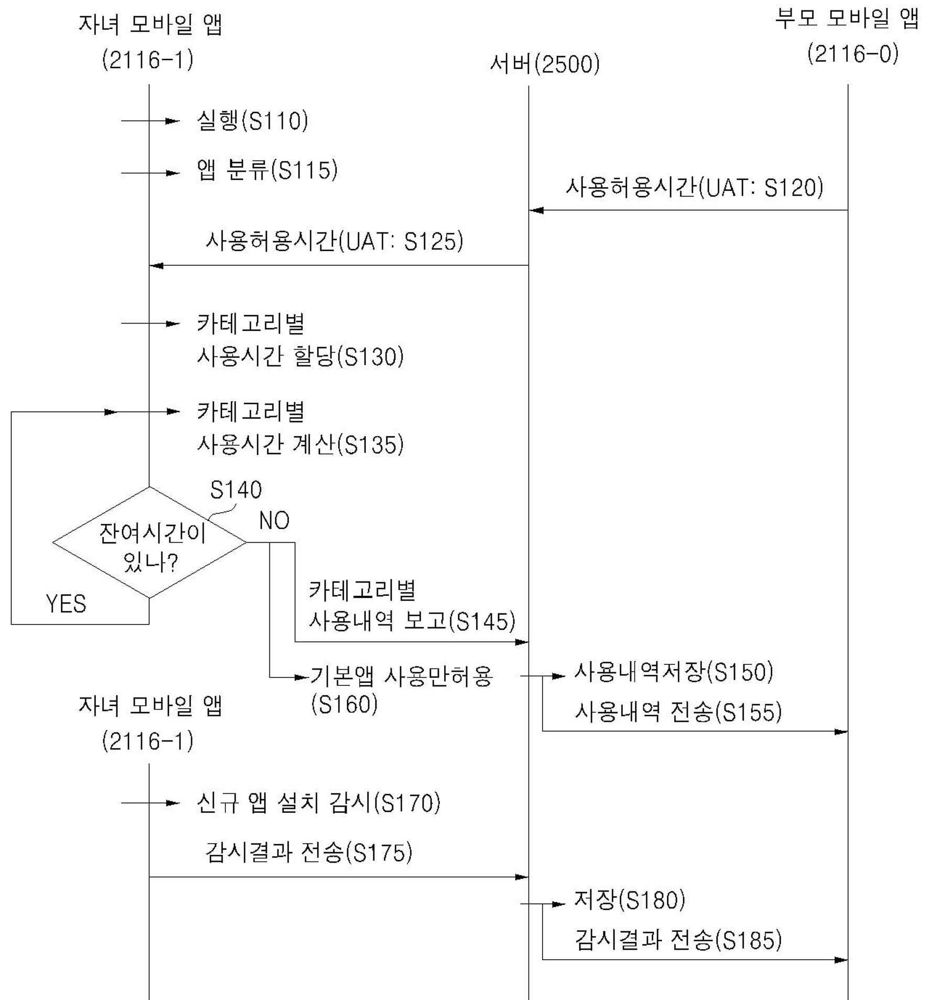
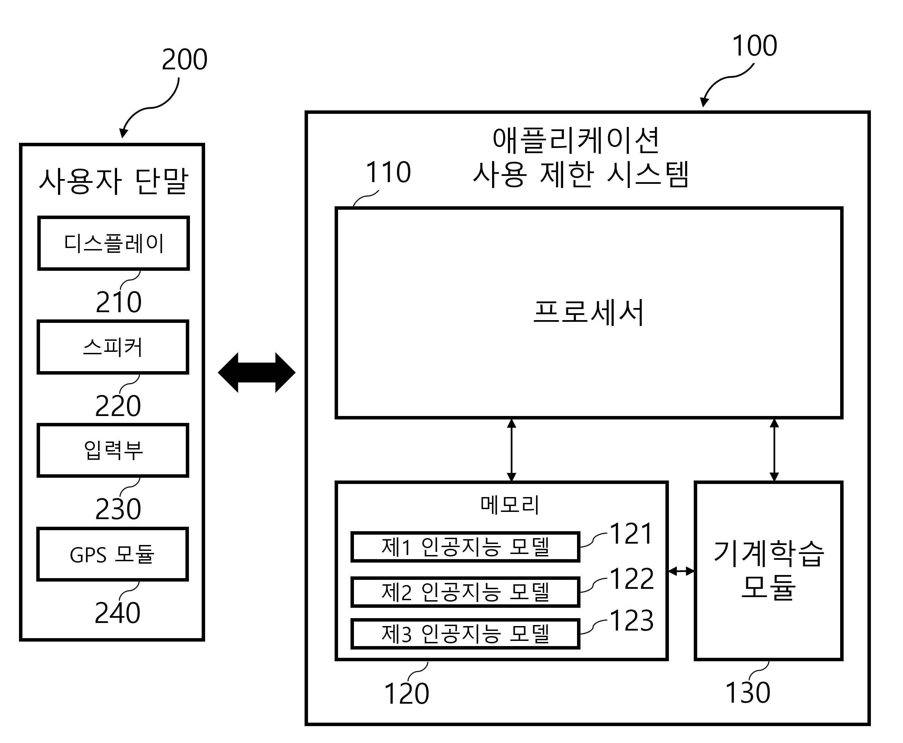

# 특허 분석 + 개발비 예측
## 1. 기존 기술 및 관련 특허 조사
본 프로젝트(도파민 컷)와 유사한 목적을 가진 기존의 여러 특허 기술들을 분석하여, 그 중 대표적인  두가지를 말하고 전체적인 요약을 담았습니다.

### 1.1 [특허 1] 모바일 앱 사용시간 할당 및 차단 시스템
* **출원인**: 주식회사 일공일바이널엑스 (120150503775)
* **주요 내용**: 이동 단말기에 설치된 모바일 앱들의 사용시간을 할당하기 위해 저장 매체에 저장된 사용시간 할당 모바일 앱이 개시된다. 상기 사용시간 할당 모바일 앱은 상기 모바일 앱들 각각의 모바일 앱 정보를 이용하여 상기 모바일 앱들 각각을 사용시간 제한 모바일 앱들과 사용시간 무제한 모바일 앱들로 분류하고, 서버로부터 일정 기간에 대한 사용허용 시간을 수신하고, 상기 일정 기간 동안 상기 사용시간 제한 모바일 앱들이 사용된 시간을 계산하여 누적하고, 누적된 시간이 상기 사용허용 시간에 도달한 후, 상기 사용시간 제한 모바일 앱들의 실행을 차단하고 상기 사용시간 무제한 모바일 앱들의 실행을 허용한다
* **관련 도식**:
  
  > *이동 단말기 내 앱들의 사용 시간을 분류하고 차단하는 프로세스*

### 1.2 [특허 2] 미션 수행 기반의 애플리케이션 사용 제한 시스템
* **출원인**: 주식회사 허슬러즈 (120220353028)
* **주요 내용**: 개시된 발명의 일 실시예에 따른 애플리케이션 사용 제한 시스템은, 설치된 애플리케이션의 이용에 대해서 제한 사항이 설정된 사용자 단말을 제어하는 프로세서를 포함하고, 상기 프로세서는: 상기 사용자 단말에 설치된 애플리케이션 중에서 제한 사항이 설정된 제한 애플리케이션을 실행하는 취지의 입력 정보인 애플리케이션 실행 명령을 상기 사용자 단말의 입력부가 수신하는지 여부를 판단하고; 상기 입력부가 상기 애플리케이션 실행 명령을 수신하면, 상기 사용자에게 미리 설정된 행동에 해당하는 미션을 수행하라는 취지의 화면인 미션 표시 화면을 표시하도록 상기 사용자 단말의 디스플레이를 제어하고; 그리고 상기 미션에 대응되는 입력 정보인 미션 완료 입력을 상기 입력부가 수신하면, 상기 제한 애플리케이션을 상기 사용자 단말이 실행하도록 상기 사용자 단말을 제어할 수 있다.
* **관련 도식**:
  
  > *사용자 단말과 프로세서 간의 미션 부여 및 앱 실행 제어 구조*

---

## 2. '도파민 컷' 프로젝트의 차별성 및 회피 전략

기존 특허 기술과의 비교를 통해 본 프로젝트만의 독창성과 기술적 우위를 정의합니다.

### 2.1 기술적 회피 및 차별성 요약
| 분석 항목 | 기존 특허 (1, 2) | 도파민 컷 (본 프로젝트) |
| :--- | :--- | :--- |
| **제어 단위** | **앱 단위(Package)** 일괄 제어 | **기능 단위(UI Node)** 선택적 제어 |
| **감지 방식** | 사용 시간 누적 및 실행 시점 감지 | **Accessibility Service**를 통한 실시간 탭 진입 감지 |
| **차별화 포인트** | 강제적 종료 및 단순 미션 부여 | **기회비용(현금, 칼로리) 환산** 알고리즘 적용 |

### 2.2 상세 회피 전략
1. **정밀 타겟팅 (Granular Control)**: 기존 특허 1이 유튜브 앱 전체를 막는다면, 본 프로젝트는 유튜브 내의 'Shorts' UI 노드만 감지하여 차단합니다. 이는 생산적인 앱 사용은 유지하면서 특정 중독 요소만 제거하는 기술적 차별점을 가집니다. 즉, 저희는 더욱 개인 친화적인 방법을 사용합니다.
2. **실시간 인터랙션 (Real-time Detection)**: 기존 특허 2가 앱 실행 직전에만 개입하는 것과 달리, 본 프로젝트는 사용 중 발생하는 무의식적인 숏폼 전환 이벤트를 실시간으로 낚아채어 제어합니다.
3. **심리적 가치 환산 (Value Conversion)**: 단순히 사용을 막는 기능을 넘어, 낭비된 시간을 사용자가 체감하기 쉬운 '경제적 가치'로 재해석하여 제공함으로써 행동 변화를 강력하게 유도합니다.
ex) "오늘 숏폼 총 시청시간: OO시간OO분OO초, 이 시간이면 최저임금 기준 0000원을 벌 수 있습니다."

---

## 3. 시스템 개발 소요 비용 상세 산정 (가상)

본 시스템의 경제적 가치를 증명하기 위해 개발 기간 4개월, 6인 인력을 기준으로 산정하였습니다.

|### 3.1 실제 소요 비용 (Direct Cost)
| 항목 | 상세 내역 | 금액 | 비고 |
| :--- | :--- | :--- | :--- |
| **인프라비** | Firebase Spark Plan   Google API | 0원   15000원 | 무료 할당량 내 개발   카테고리 분류 및 OCR |
| **장비비** | 안드로이드 단말기 및 개인 PC | 0원 | 팀원 보유 장비 활용 |
| **등록비** | Google Play Console 등록 | 약 35,000원 | $25 (최초 1회) |
| **학습 및 기타** | 도서 및 자료 조사비 | 0원 | 도서관, 인터넷, 기존 강의자료들, 수업에서 사용한 서적들 사용 |
| **합계** | **예상 지출 비용** | **약 50,000원** | |
 

### 3.2 개발 공수 산정 (Opportunity Cost)
실제 현금 지출은 아니나, 6인의 학부생이 4개월간 투입한 노력을 2026년 최저임금 기준(주휴수당 등 포함 대략적인 값)으로 환산한 가치는 다음과 같습니다.
* **산출 방식**: 6명 × 4개월 × 주당 약 15시간 투입 × 최저시급
* **추정 가치**: 약 **1,800만 원 상당**의 인적 자원 투입
