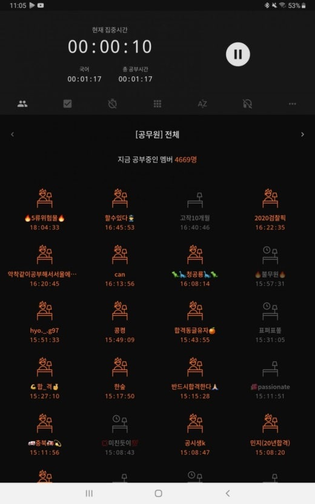
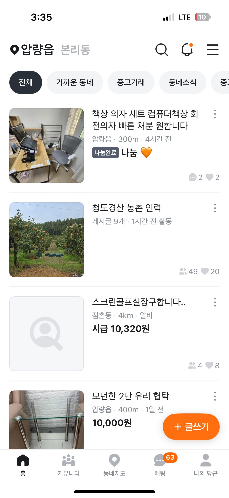
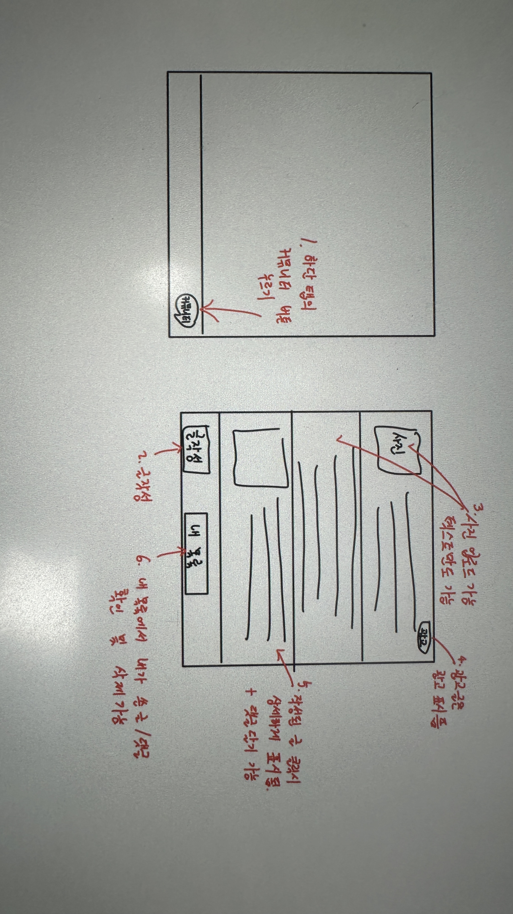

# 5.8(화) 회의 내용 정리

## 1. 기존 기획안 피드백 및 문제점
* **단순함:** 개발 기간과 투입 인원에 비해 기능이 너무 단순함.
* **개인화 부족:** 사용자별 맞춤 설정 기능이 미흡함.
* **시장성 의문:** 실제 출시 시 사용자 유입 및 지속 사용 유인이 부족함.
* **비즈니스 모델:** 수익 창출 방안이 고려되지 않음.

---

## 2. 주요 변경 및 개선 사항

### 2.1 사용자 참여 유도: 대결 구도 도입
* **도파민 챌린지:** 사용자 간 '누가 숏폼 시청을 더 잘 참았는가'를 겨루는 경쟁 시스템 도입.
* **정산 주기:** 매일 자정을 기준으로 점수 초기화 및 결과 발표.
* **보상 및 패널티 (Gamification):**
    * **커뮤니티 권한:** 챌린지 성적에 따라 글자 크기 차등 부여 (우수자: 크게, 미흡자: 작게).
    * **방(모임) 내 우선순위:** 상위 유저에게 '대장' 칭호 부여 및 하위 유저 대상 메시지 전송 기능 제공.
    * **시각적 요소:** 전용 이모티콘 및 칭호 시스템.

### 2.2 맞춤형 점수 체계: 차등 벌점제
* **카테고리별 차별화:** 오락용과 교육용 영상을 구분하여 점수 차감 폭 설정.
* **초기 설정:** 회원가입 시 설문을 통해 유익한 카테고리와 독이 되는 카테고리를 직접 분류.
* **위험도 순위(Priority):** 
    * 줄이고 싶은 카테고리를 1위부터 5위까지 설정.
    * 위험도 1위 카테고리 시청 시 점수가 가장 큰 폭으로 하락.

---

## 3. 기술적 구현 및 운영 방안

### 3.1 기술적 접근
* **OCR 기반 분류:** 영상 내 텍스트를 인식하여 카테고리(게임, 유머, 교육, 사회, 먹방, 스포츠, 음악, 연예 등) 자동 판별.
* **데이터 관리:** 실시간 시청 데이터를 기반으로 도파민 점수 산출 및 매일 자정 서버 데이터 초기화.

### 3.2 카테고리 구성 (9종)
* 게임 / 유머 / 교육 / 사회 / 먹방 / 스포츠 / 음악 / 연예 / 기타

### 3.3 기대 효과 및 수익화
* **사용자 경험:** 대결 구도와 보상을 통한 능동적인 참여 및 앱 리텐션 확보.
* **수익 모델:** 랭킹 관련 아이템, 특수 이모티콘 구매 등 수익 창출 기회 마련.

## 4. 디자인 참조 (모임 기능 예시)

### 모임(방) 기능 추가

시중에 나와있는 "열품타" 앱을 참고해 유저별로 모임을 생성하여 단합할 수 있도록 함.
모임(방) 만들기와 참여하기로 구성. 
찌르기 기능(메시지 입력, 첨부파일 등 가능) 을 통해 다른 유저에게 알림(경고) 보내기 가능

금일 도파민 점수가 높은 우수 유저에게 주는 아이템이지만, 앱 내 소액 결제를 통해서 구매 가능.
-> 수익 창출 가능

### 모임 기능 예시 (열품타 앱 내 사진 참고) 

## 5. 커뮤니티 (웹 기반으로 진행할 예정)

### 5.1 커뮤니티 기능 수정

기존의 앱 내에서 사용가능한 작은 커뮤니티에서 웹 기반으로 따로 분리함.
앱에서는 모임(방) 내 유저들끼리의 간단한 소통만 가능.
웹의 커뮤니티를 통해 타 유저들과 소통가능.
웹의 커뮤니티에서 배너 광고를 띄워주며 수익 창출.
(앱에서는 숏폼 제한 역할을 수행하며 기본에 충실히 하고, 웹에서 따로 광고를 하여 앱 사용에 모순이 없게 하고자 웹으로 따로 뺌.)

상점(스토어)에서 찌르기 뿐만 아니라 광고하기(확성기) 아이템을 구매하여 개인 광고도 가능.
확성기를 쓰면 커뮤니티에 일정시간 고정되거나 눈에 띄게 띄워줌.

### 5.2 웹 기반 커뮤니티에서의 광고 참고 앱(당근 마켓) 

시중에 나와 있는 당근 마켓을 참고함.(아래 사진의 청도 경산 농촌 인력 참고)

### 5.3 커뮤니티 화면 구성 설명

앱 실행 후 화면 하단의 커뮤니티 버튼을 클릭 시 웹의 커뮤니티 창으로 연결됨. 
웹 커뮤니티 창에서는 글작성/글삭제, 댓글 달기 등의 기본적인 커뮤니티 기능과 위에서 언급한 개인 광고 등이 가능함

